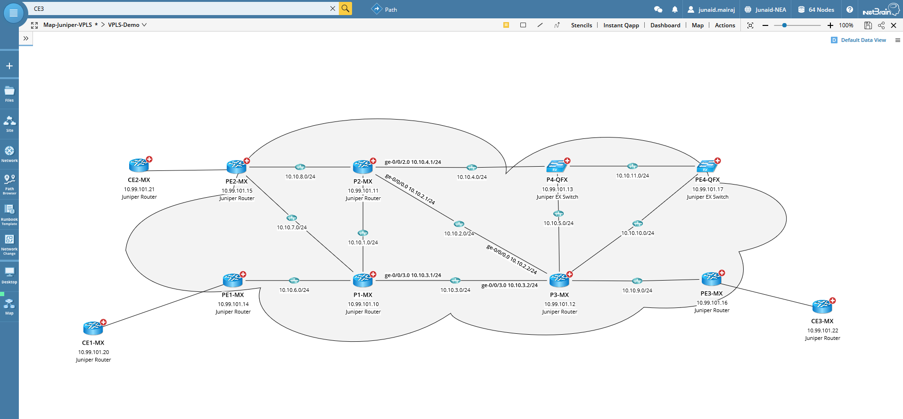
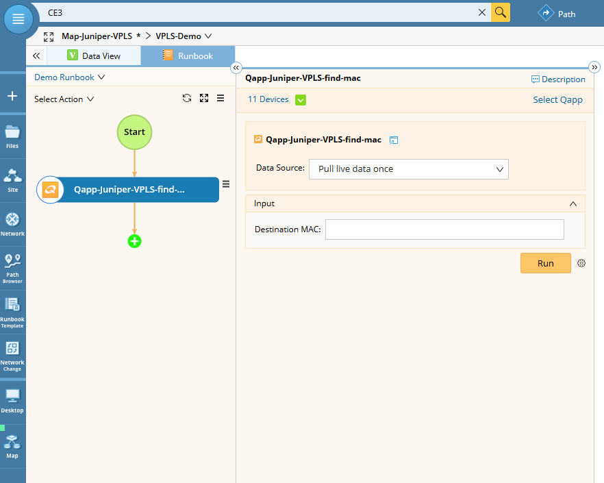
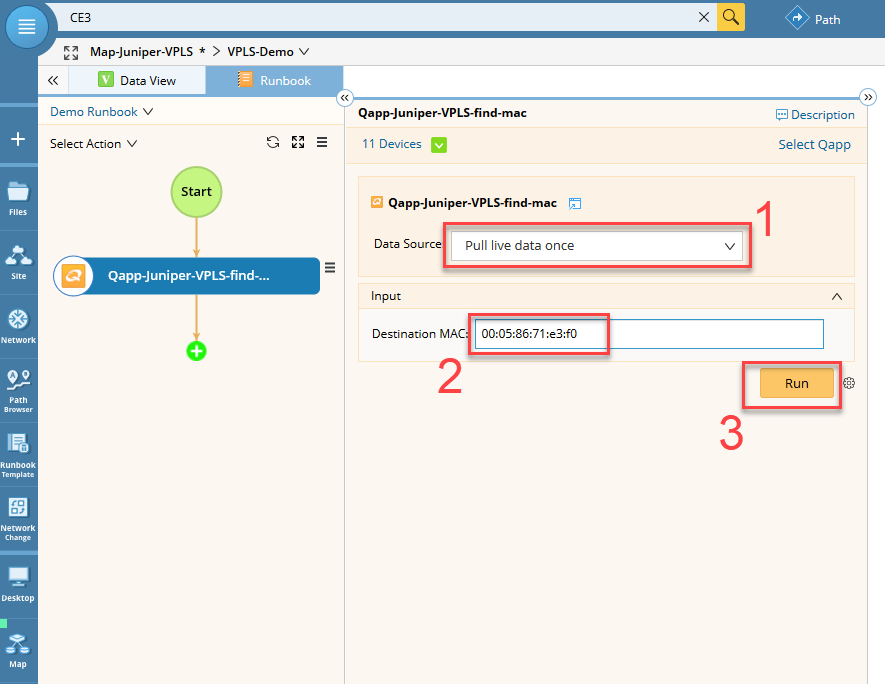
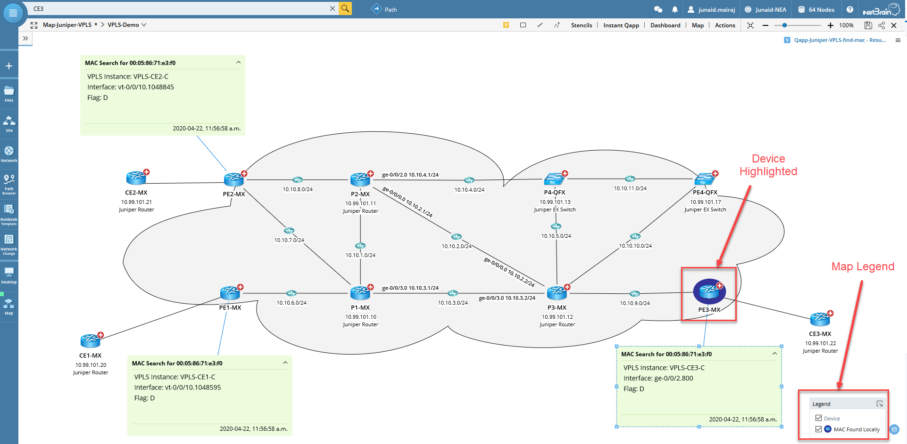
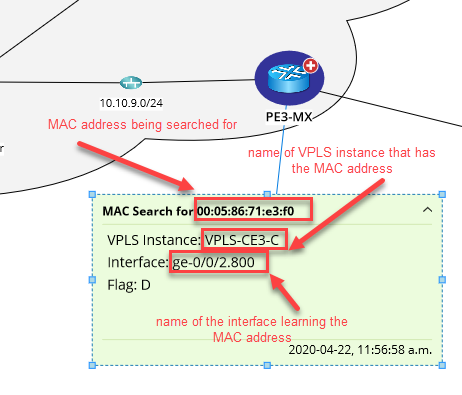

# Netbrain Qapp Library - Find MAC in a VPLS Domain


### Qapp's Description

This Qapp scans VPLS enabled Juniper nodes on a network and locates a user specified MAC address and reports the interface it is being learned from.

### Qapp Use Case

Troubleshooting in VPLS networks can be a challenging tasks. Since the traffic is labelled switched, it can be very hard to find certain infomration about end hosts in the network core. Locating an end system's MAC address is one such use example. If you have a large VPLS domain consisting of many PE nodes and hundreds or thousands of end devices being connected to each PE, finding an end host's MAC address can be challenning.

This Qapp will help you locate the MAC address of an end host in a VPLS domain. The MAC address to locate will be specified as input to the Qapp as shown below.

### The Example Network

Below is a demo VPLS network that consits of a 4 PE routers and 4 P routers. Also shown are three CE devices.




### Running the Qapp


#### 1. Add Qapp to a Runbook:
Once you add the Qapp to a runbook, change the "Data Source" to "Pull live data once" and provide the MAC address to be located as the sole input to the Qapp as shown in below screenshots:




#### 2. Provide Input and Run the Qapp:
Select "Pull live data once" from "Data Source" and provide the MAC address to be located and then run the Qapp:




### Interpretting the Results

Once the Qapp runs, it will scan all the VPLS PE nodes on the map and try to locate the specified MAC address. The results are depicted using different features of NetBrain's interfaces and are described in the following sections.

#### Device Highlight

The device where the MAC address is found locally is highlighted. The "Legend" in the bottom right corner of the map will show the color the device(s) will be highlighted with. In this exmaple, PE3-MX is highlighted in blue color as the MAC address is learned locally on this device.



#### Interface Highlight

None

#### Device Data Units

None

#### Link Data Units

None

#### Device Notes

The result of the MAC search opertaion on each node are shown as a 'Device Note' attached to each deivce. In the exmaple we see that on PE1, the given MAC address is being learned from a tunnel interface (vt-*) while on PE3, the MAC address is being learned locally via the ge-0/0/2.800 interface.




#### Commands Used

```
show vpls mac-table
```

#### Sample Command Outputs

````
admin@PE3-MX> show vpls mac-table                              

MAC flags       (S -static MAC, D -dynamic MAC, L -locally learned, C -Control MAC
    O -OVSDB MAC, SE -Statistics enabled, NM -Non configured MAC, R -Remote PE MAC)

Routing instance : VPLS-CE3-C
 Bridging domain : __VPLS-CE3-C__, VLAN : NA
   MAC                 MAC      Logical          NH     RTR
   address             flags    interface        Index  ID
   00:05:86:71:e3:f0   D        ge-0/0/2.800    

admin@PE3-MX> 
````


### Download link: [Qapp-Juniper-VPLS-find-mac.xapp](qapps/Qapp-Juniper-VPLS-find-mac.xapp)


Tags: #juniper #vpls #qapp

