# Netbrain Qapp Library - Run Audit and Compliance Rules On Device Configuration 


### Qapp's Description

This Qapp lets you run audit and compliance rules against your device configuration and presents a status of pass or fail against each rule for each device.

### Qapp's Use Case

In order to make sure that your device configurations are compliant with standards like SOX, HIPAA, PCI or even your own in-house policies, you need to run a battery of checks against the configuration for each device in your network. This Qapp can help speed this verification process many folds.

This Qapp takes as an input a text file (written in YAML format) that defines all the compliance/audit rules and runs them against the devices under consideration and produces results in a tabular format to show which rules passed and which ones failed on each of the devices.

### The Example Network

Lets take the example of a couple of Cisco devices to conduct an audit. There is no need to add devices on the map. However, we need to import the audit template file into NetBrain. Go to "Files", navigate your desired hierarchy, right-click a folder name and select "Upload Windows Files". Select the file to upload and complete the procedure. These steps are illustrated in the screenshot below:

__Click "Files" icon:__

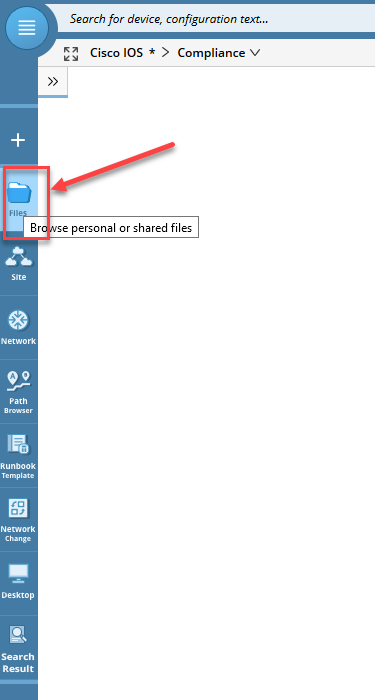

__Select the desired folder and select "Upload Windows Files":__

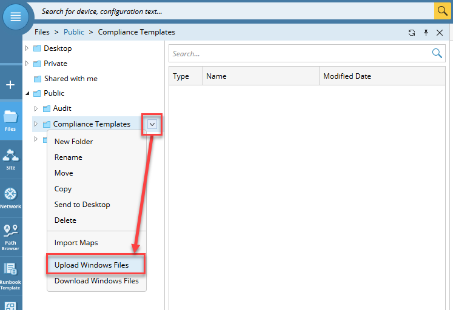

__Select the audit rules file and complete the upload process:__

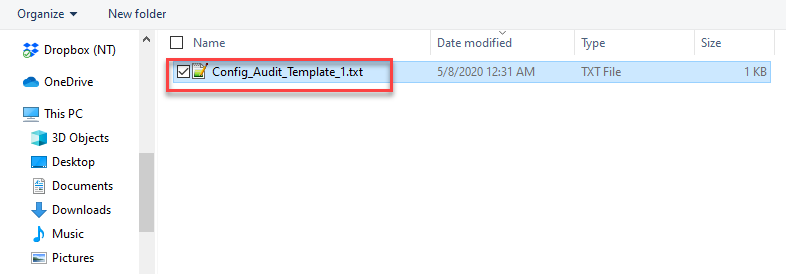

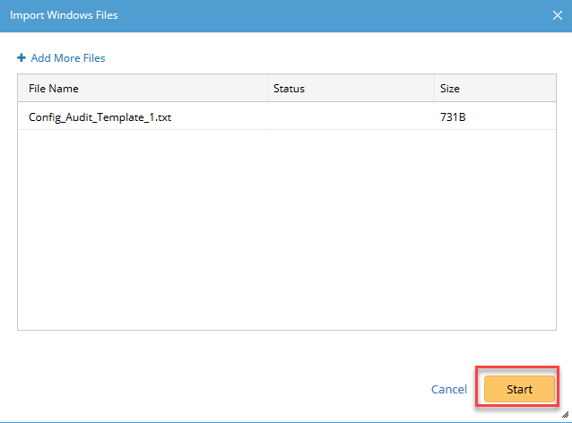

__The audit template file should be visible in the folder now:__

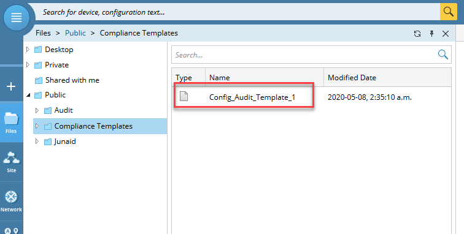


### Running the Qapp

Its time for some action!

#### 1. Add Qapp to a Runbook:
Start with a new map and add the Qapp to the runbook.

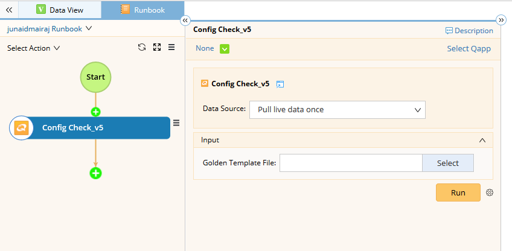


Once you add the Qapp to a runbook, select the devices you want to run the audit against:

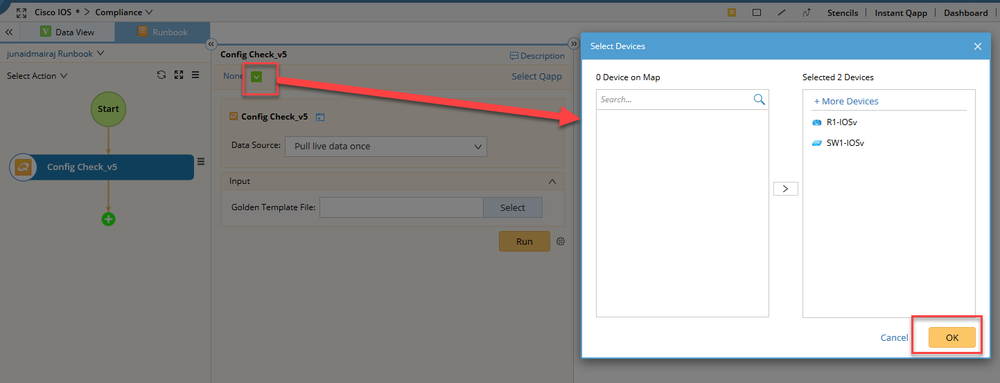


#### 2. Provide Input and Run the Qapp:
Select "Pull live data once" from "Data Source" and press the "Select" button to navigate and specify the audit template file to use and finally press the "Run" button to see some action.

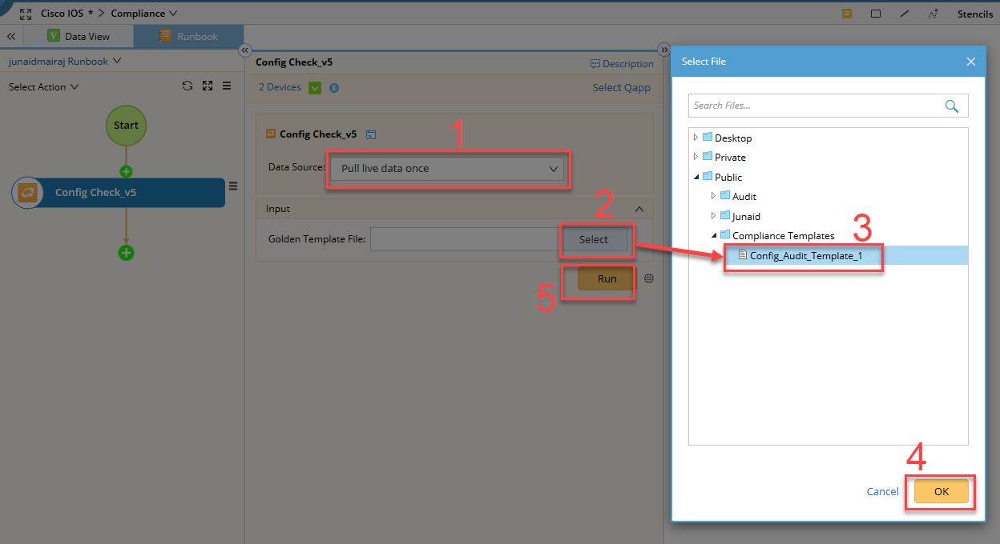


### Finding the Results

Once the Qapp execution finishes, the results are populated in two tabs named "Failed_Report" and "Full_Report" near the bottom of the page as shown in the screenshot below.

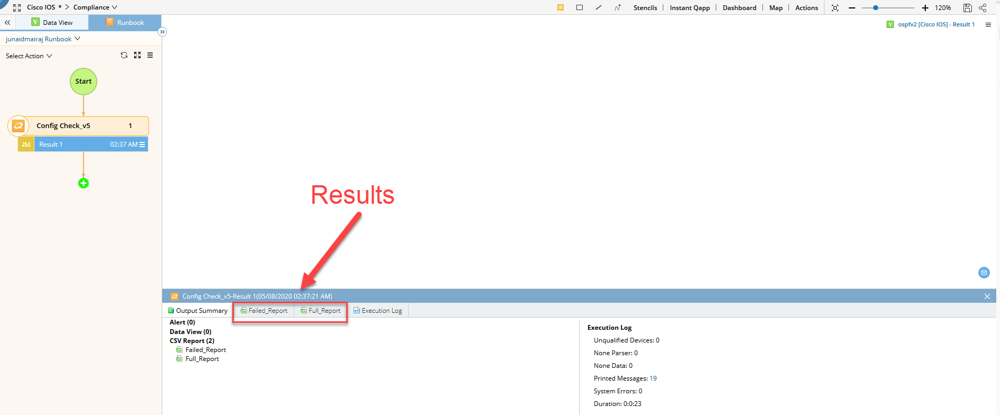


#### The Failed Report

The "Failed_Report" tab shows all the rules that failed for each of the devices. This is quick way to know how many tests are failing from your battery of tests.

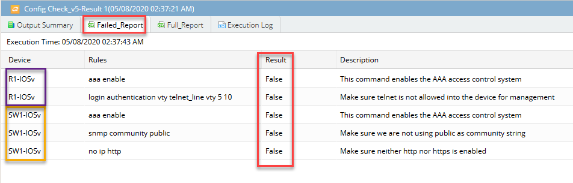

#### The Full Report

The "Full_Report" tab shows all the rules, passed and failed, that failed for each of the devices. A value of "False" under the "Results" column means that the test failed for that particular device while "True" means that the test passed.

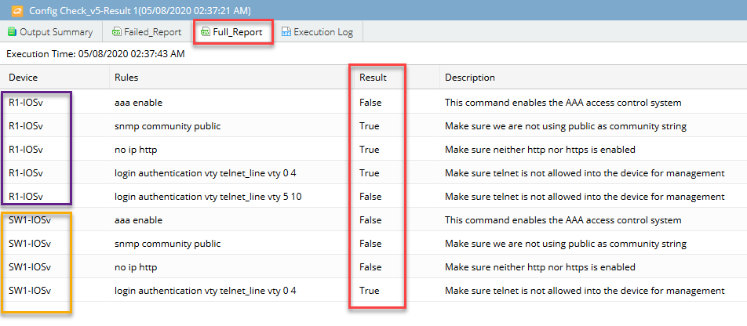


#### Export Results

You have the option to export both the reports separately into an Excel file for offline processing and for sharing the results. Open the desired report tab and press the icon to export the file as shown in the example below:

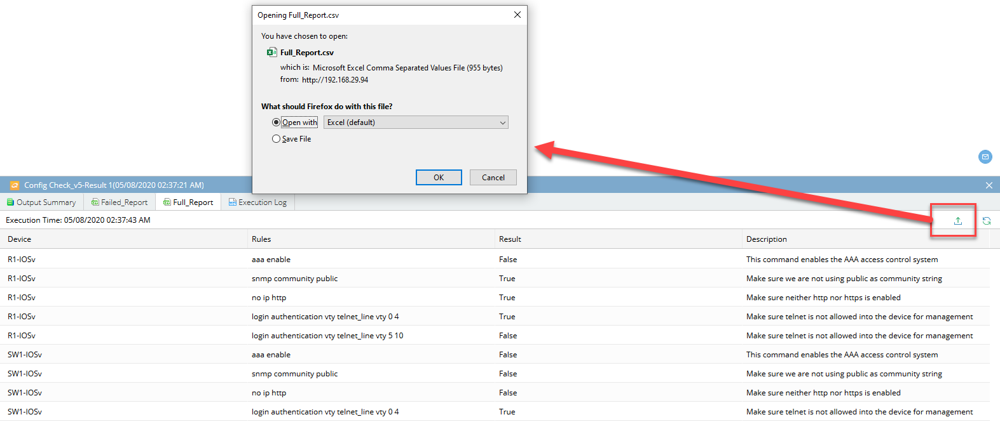


#### Audit/Compliance Template Used

In order to get accurate results, it is important to understand the correct use of the audit template file. The file used for this example is as follows:

```
Config_Audit_1:
 aaa enable:
     match:
     - 'no aaa new-model'
     exclude: True
     description: 'This command enables the AAA access control system'

 snmp community public:
     match:
     - '^snmp-server community public.*'
     exclude: True
     description: 'Make sure we are not using public as community string'

 no ip http:
     match:
     - '^no ip http server'
     - '^no ip http secure-server'
     description: 'Make sure neither http nor https is enabled'

 login authentication vty telnet:
     match:
     - 'transport input ssh$'
     start: '^line vty \d+.+'
     end: '!'
     description: 'Make sure telnet is not allowed into the device for management'
     repeated: True

```

The structure of the file is quite self explanatory. Some important rules to adhere to while making a template file are as follows:

* __Mandatory Field:__
```
    match
```

* __Optional Fields:__
```
    repeated
    description
    exclude
```

* __If repeated is used, it is mandatory to use the following fields:__
```
    start
    end
```


* __multiple match conditions are logically ANDed together__

* __'exclude' only works for non-repeating configuration__

<BR>

### Interpreting the Results

Lets take a look at why some of the tests failed. The failed report is reproduced below for easier reference:


The __"aaa enable"__ rule failed on both devices because of the presence of the following statement on the two devices:

```
R1-IOSv#sh run  | i aaa
no aaa new-model
R1-IOSv#
```

The __"login authentication"__ rule failed on R1-IOSv because of the presence of telnet for some of it vty lines, specifically vty lines 5 to 10:

```
R1-IOSv#sh run | b line vty
line vty 0 4
 login local
 transport input ssh
line vty 5 10
 login local
 transport input telnet ssh
!
```

The __"snmp community"__ rule failed on SW1-IOSv because of the presence of the snmp community named "public" in its configuration:

```
SW1-IOSv#sh run  | i snmp
snmp-server community some_secret_community RO
snmp-server community public RO
SW1-IOSv#
```

The __"no ip http"__ rule failed on SW1-IOSv because it is running http service as specified in the configuration while R1-IOSv has both http and https disabled:

```
SW1-IOSv#sh run | i http
ip http server
no ip http secure-server
SW1-IOSv#


R1-IOSv#sh run  | i http
no ip http server
no ip http secure-server
R1-IOSv#
````


### Final Note

Having the ability to specify your own input YAML file containing audit rules enables you to create custom audit and compliance policies. This coupled with NetBrain's Qapp functionality gives you the ability to perform custom audit and compliance checks on large networks in a scalable manner.


### Download links
Qapp: [Config Check_v4.xapp](qapps/Config%20Check_v4.xapp)

Sample Template File: [Config_Audit_Template_1.txt](qapps/Config_Audit_Template_1.txt)

<BR><BR>

Tags: #qapp #audit #compliance

<!---

http://192.168.29.94/map.html?t=8b26ed3e-4c8c-45ac-677d-9485779ca2b3&d=3da25e68-c5bb-4425-9d8c-3eac1e53b6e0&id=8e669745-b4dd-6cdb-4ca1-8ef68b535e4c&rba=2b7287fe-4c0d-a74b-efac-e4d642e42418

--->