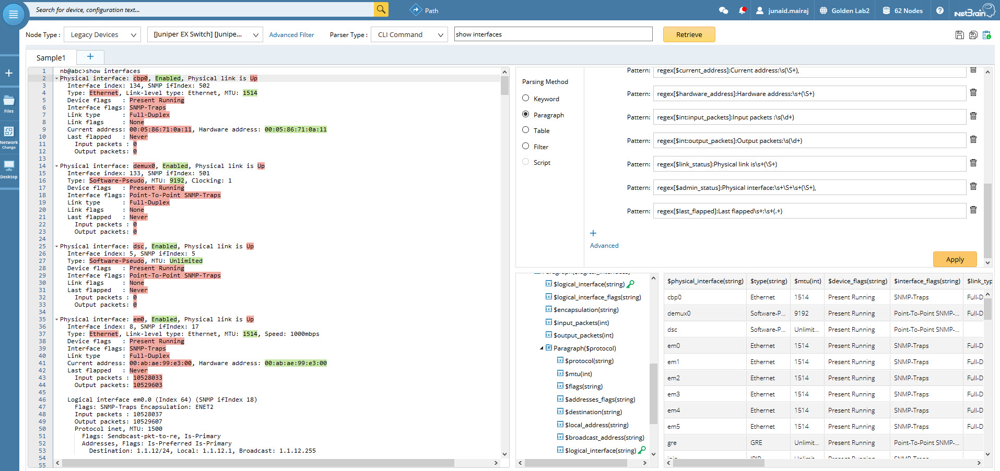
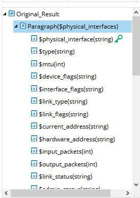
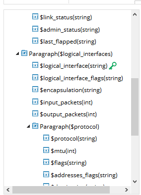
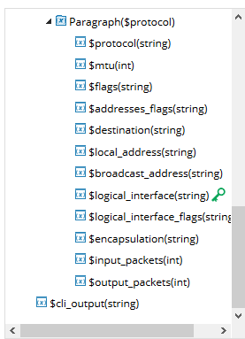

# Netbrain Parser Library

### Vendor: Juniper [JUNOS Common]
### Parser Type: cli [|configuration|snmp|api]
### Command: show interfaces
### Driver List:
* Juniper Router
* Juniper EX Switch
* Juniper SRX Firewall

### Summary:
Parses the output of interface information like interface name, MTU, packet count etc and stores the output in a tabular format.

### Download link: [show interfaces [JUNOS Common].xpar](show%20interfaces%20[JUNOS%20Common].xpar)
NetBrain version: ...
### Sample Command Outputs and Test Status:
[1]: ../outputs/01_show_interfaces_vmx_14.1R4.8.txt
[2]: ../outputs/02_show%20interfaces_vqfx-1000_17.4R1.16.txt
[3]: ../outputs/03_show%20interfaces_firefly-perimeter_12.1X47-D20.7.txt

- [x] [vmx, 14.1R4.8][1]
- [ ] [vqfx-1000, 17.4R1.16][2]
- [x] [firefly-perimeter, 12.1X47-D20.7][3]

### Parser Screenshots:

### Parsed Variables:

