#  Making Changes to the Network with NetBrain Ansible Agent   

NetBrain Ansible Agent is an application used to receive tasks assigned by NetBrain Front Server. It calls Ansible command line to execute Playbook and return the execution results to NetBrain Front Server and IE front end to display.

*Version: NetBrain v8.x*

## Use Case

To reuse existing Ansible playbook ( or new playbook) to make changes to the network programmatically, you could quickly build an Ansible inventory with the credetials and some existing variables in NetBrain to execute the changes. Planning, request change, and execute changes are identical to existing NetBrain Change procedure. To target specific groups of devices, you could build customized ansible groups by reused device group, site devices, device types. In this example, we demo how to make changes to SNMP configuration with  NetBrain Ansible Agent to cover the features.  

## Prerequisite 

* NetBrain v8.x
* NetBrain Ansible Agent Installed in the Ansible Machine. 

*In the example, we use NetBrain Front Server Controller to install Ansible*
*Installation is not cover this is article, please refer to the installation guide https://www.netbraintech.com/docs/ie80/help/index.html?installing-ansible-agent-on-linux.htm*
## Solution

### 1. Open Network Change
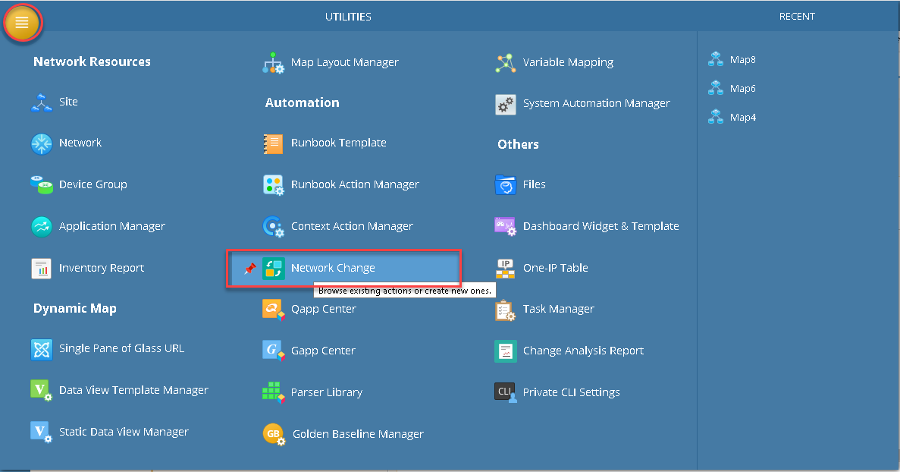


*To learn more about this, please see: https://www.netbraintech.com/docs/ie80/help/index.html?manage-network-change.htm*

### 2. Create New Network Change 

* In this example, we reused Change Template - Ansible for Legacy Network Change

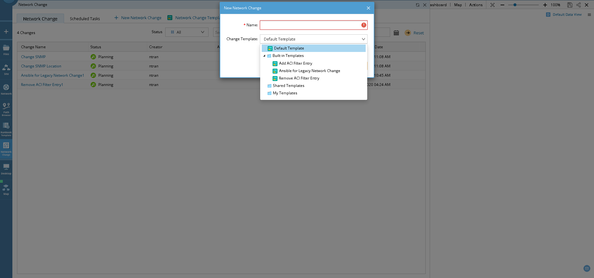


### 3. Build Inventory 

* Add devices to inventory, screenshot below showing adding Devices in  Device Group with the name Boston

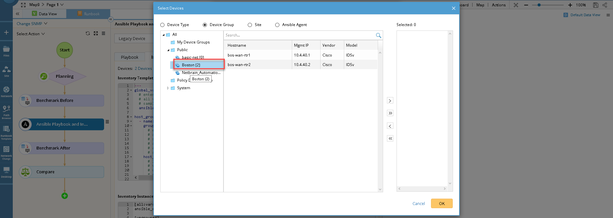

* Define Host Groups (Ansible groups) which will be using in the Ansible Playbook. 

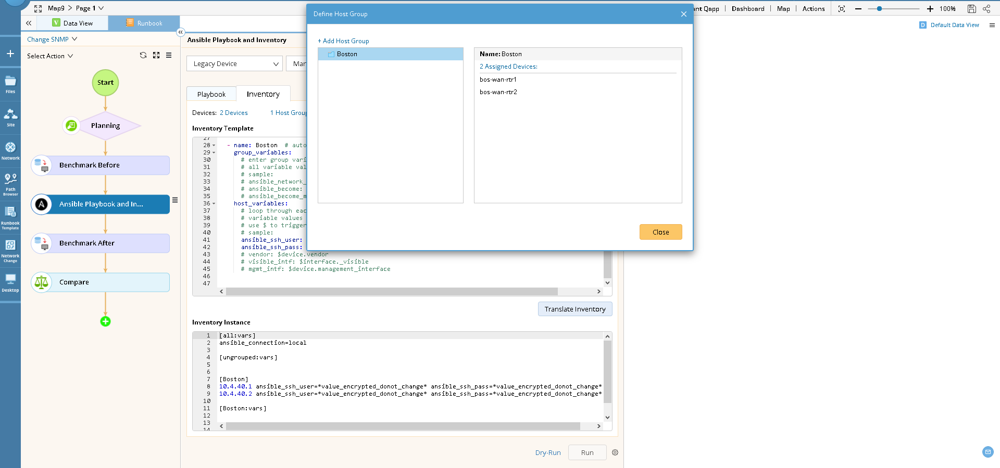

* ssh username and password was automated loaded into the Inventory. we could add more variables into the Inventory. In this example, i created variable snmp_location 

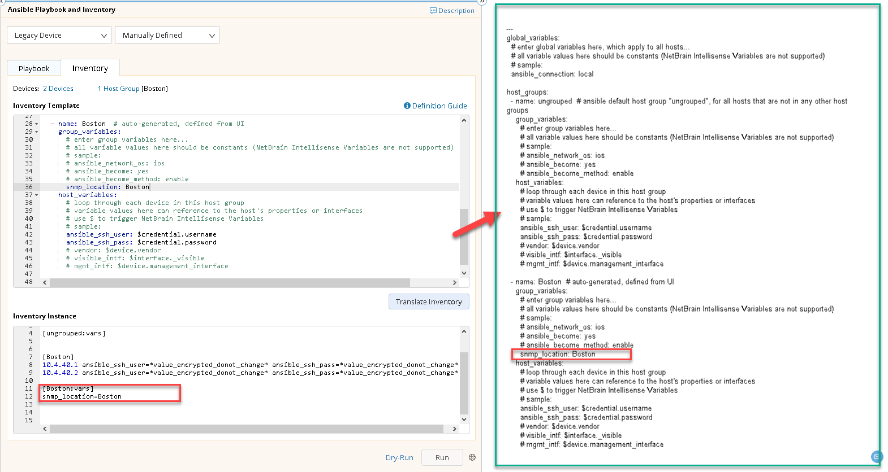

* Add Ansible playbook. Few options are currently supported are copy and paste, load local file and Git SCM such as GitHub

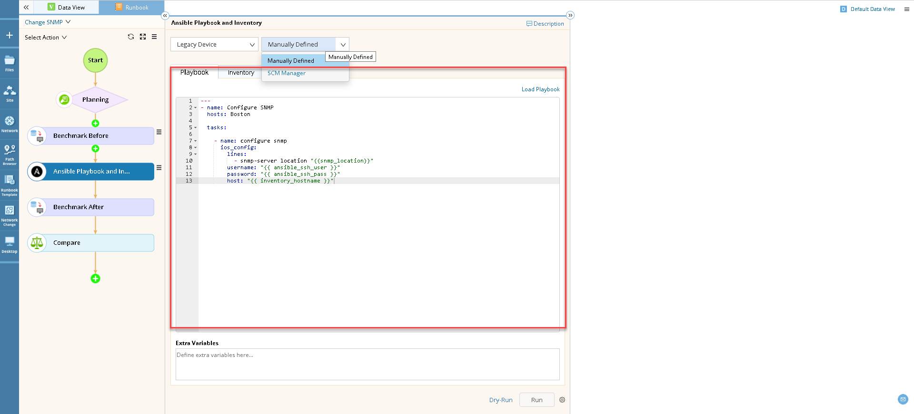 
  
* Dry run is supported. In addition, you could set more flag such as -vvv to see verbose  

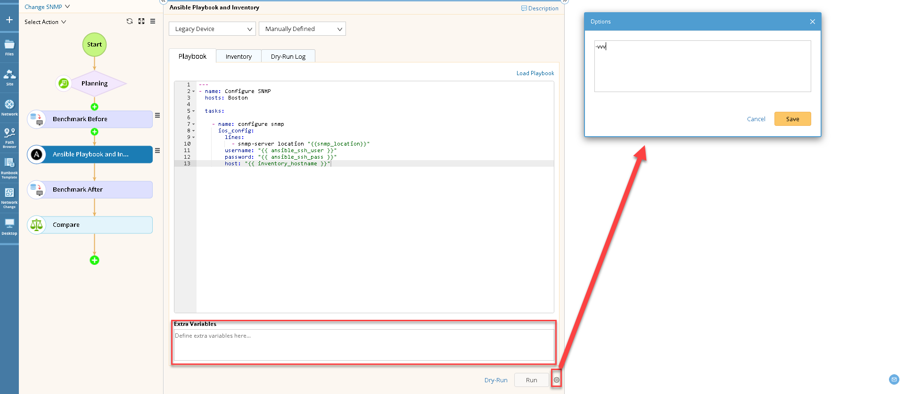 

## Results

* Ansible Playbook executed 
  
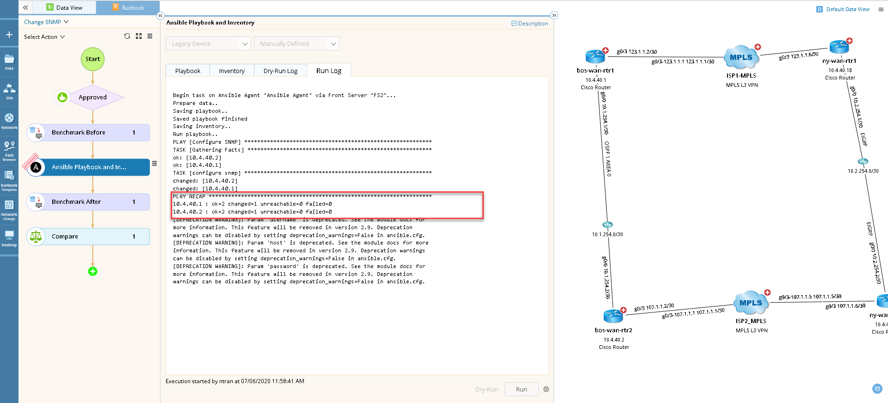 

* Compare Before And After Configuration. 
  
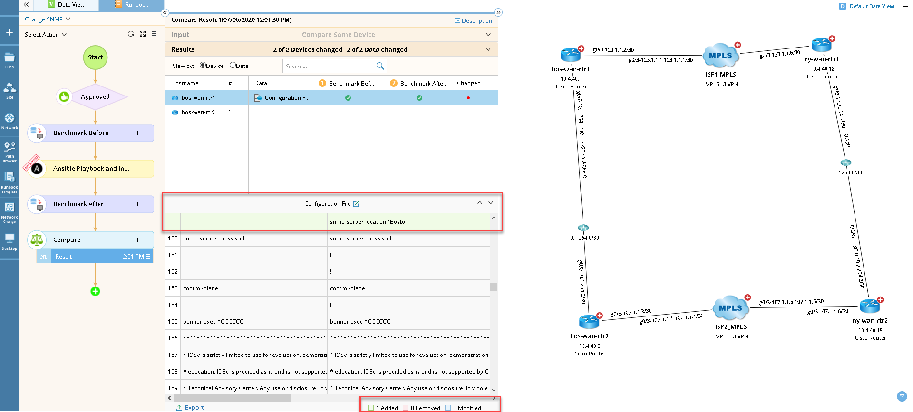 

* Note that depend on the changes, we could compare other tables for some considerations such as routing, security, interconnect, interfaces etc...  Screenshot below show built-in tables supported by NetBrain. 

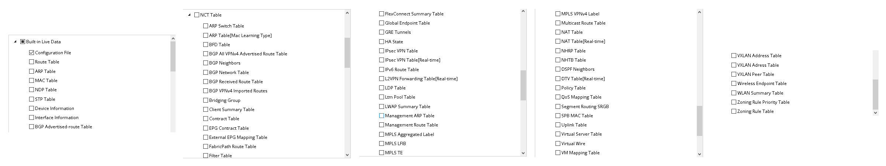 

* Demo to show the steps from request, approval, benchmark before , execute ansible node, benmark after and finally compare the configuration.
  
 


## Extras 

* There are other options to verify changes  such as using Data View, Qapp, execute CLI, verify application, etc.

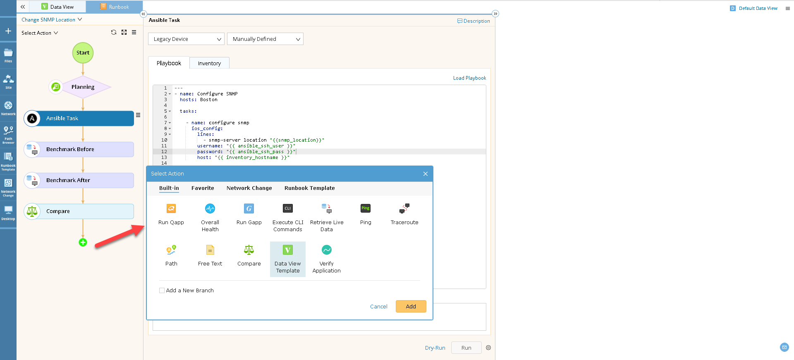

* Ansible Playbook used in the example

```
---
- name: Configure SNMP 
  hosts: Boston
  
  tasks:
  
    - name: configure snmp  
      ios_config:
        lines: 
          - snmp-server location "{{snmp_location}}"
        username: "{{ ansible_ssh_user }}"
        password: "{{ ansible_ssh_pass }}"
        host: "{{ inventory_hostname }}"
```

### *Disclaimer*
*The solution provided above is developed by testing environment so may not suit to every scenario, please feel free to contact NetBrain Support <Support@netbraintech.com> if any questions related to the solution.* 