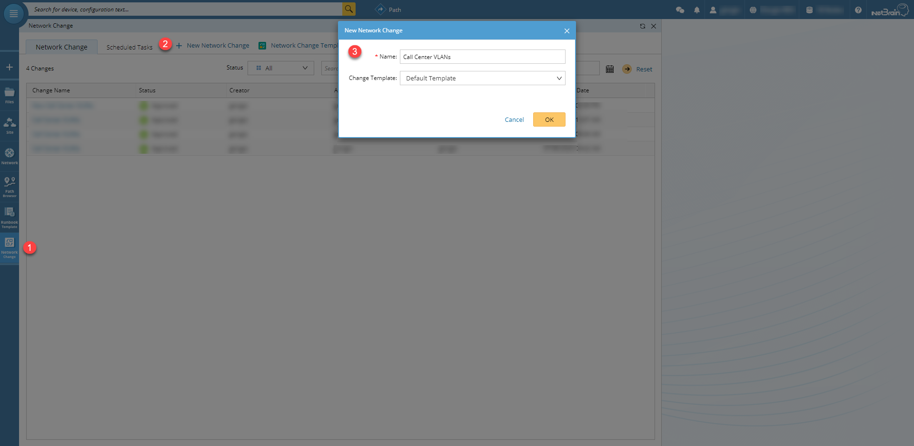
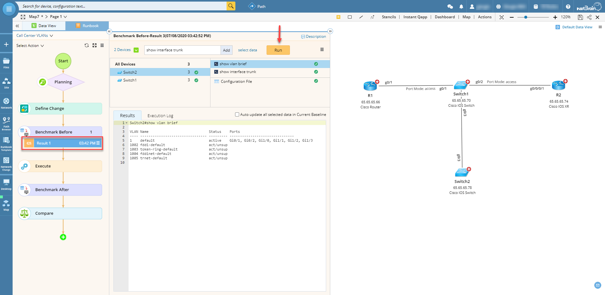
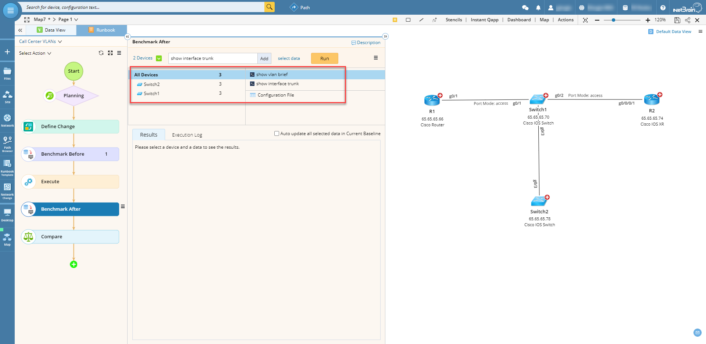
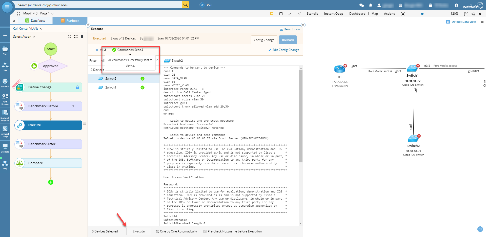
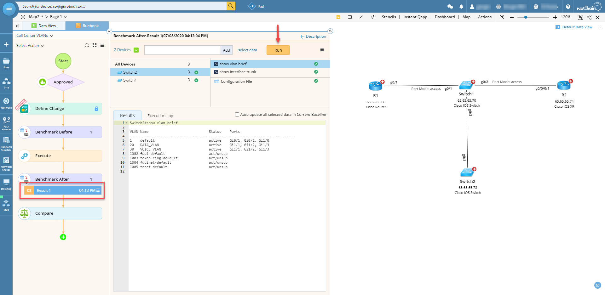
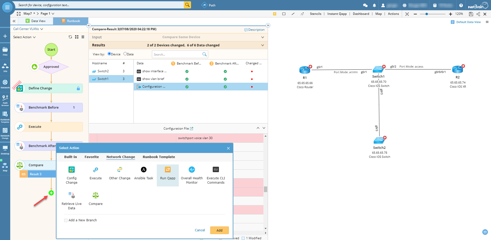
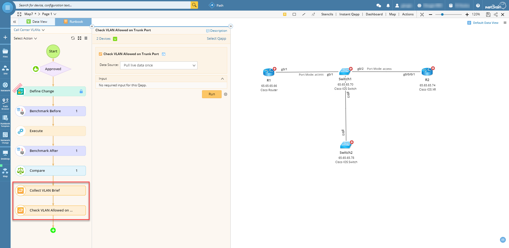
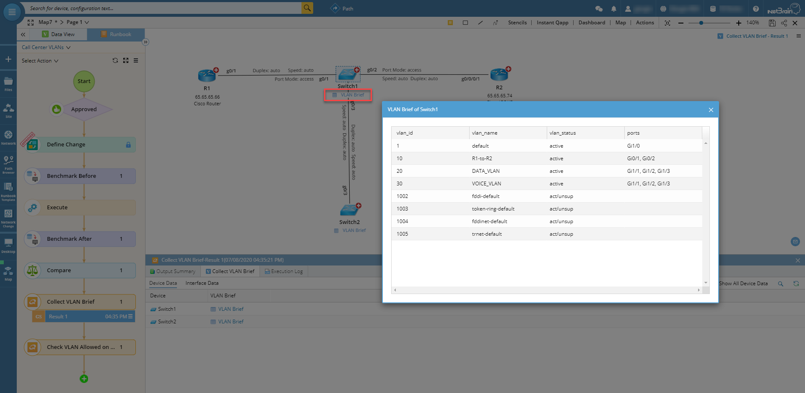
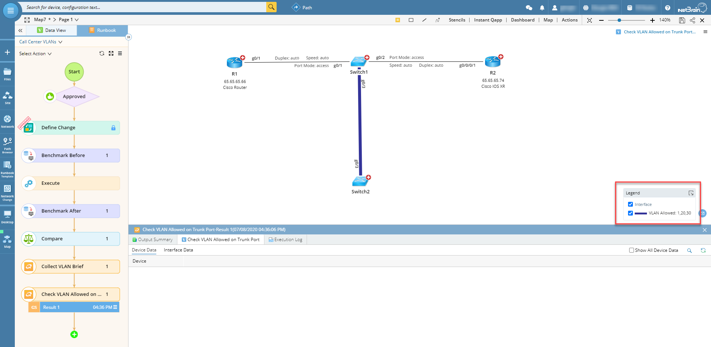

# Managing network changes with NetBrain
TBD

**Version: NetBrain v7.x, v8.x**

## Use Case
TBD

## Solution

* Create a `New Network Change` using the Default Template.

* `Define Change` by adding a configuration template to the desired devices. It is good practice to have a rollback plan ready.

* Define what to `Benchmark Before` the change is executed; the results will be compared later.

* Run the benchmark and the results will be stored in the Runbook.

* Do the same for the `Benchmark After` but without running it until after the change is executed.

* Once change is approved, it's time to `Execute`. After execution completes, make sure that all commands have been successfully sent to all desired devices.

* Now we can run the `Benchmark After` and the results will be stored in the Runbook.

* Finally, we'll use the results from each benchmark to `Compare` the before and after.

## Extras

* There are other options to verify changes; in this case, we'll use the built-in Qapps "Collect VLAN Brief" and "Check VLAN Allowed on Trunk Port".

* The first Qapp will display a VLAN table for each device on the map; the second Qapp will highlight the trunk interfaces with the allowed VLANs. This way we are displaying on the map the results from the change that has just been executed.

*To learn more about this, please see: https://www.netbraintech.com/docs/ie80/help/index.html?manage-network-change.htm*

### *Disclaimer*
*The solution provided above is developed by testing environment so may not suit to every scenario, please feel free to contact NetBrain Support <Support@netbraintech.com> if any questions related to the solution.*