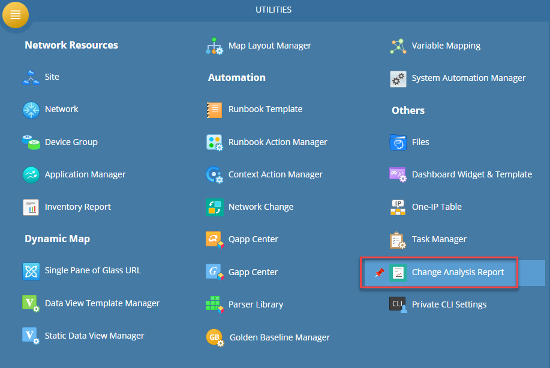
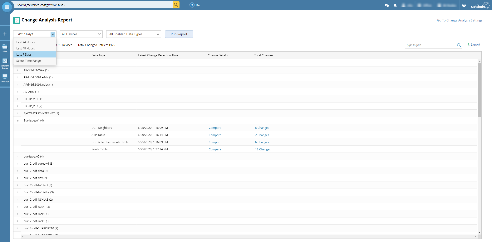
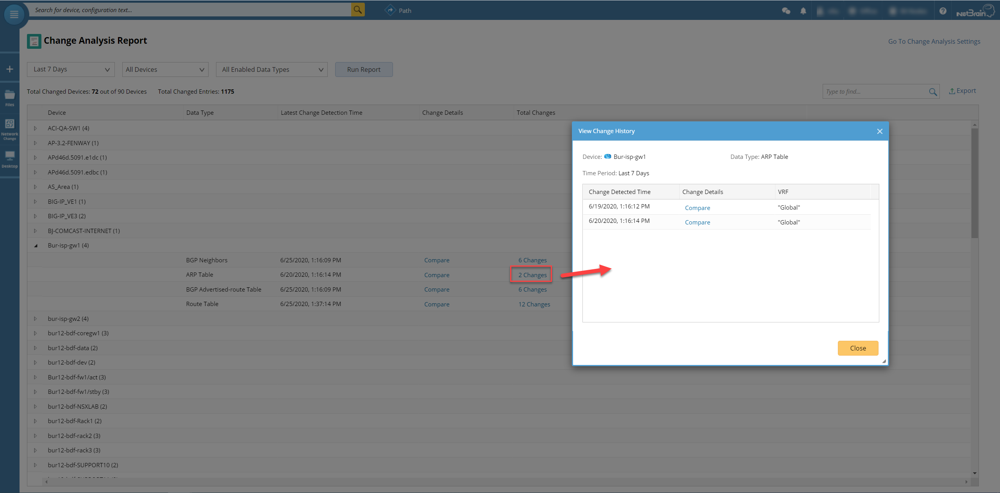
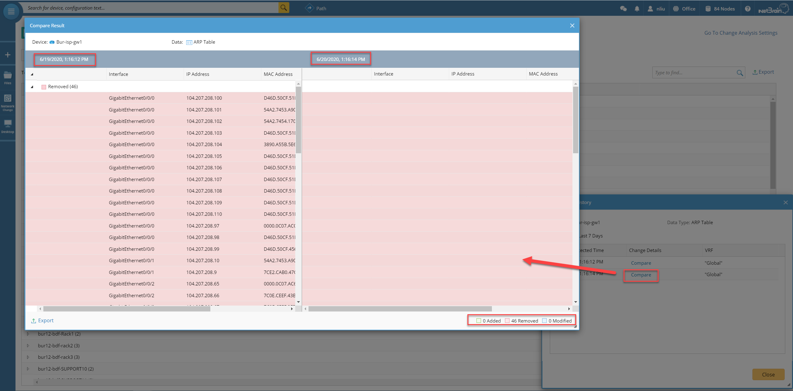
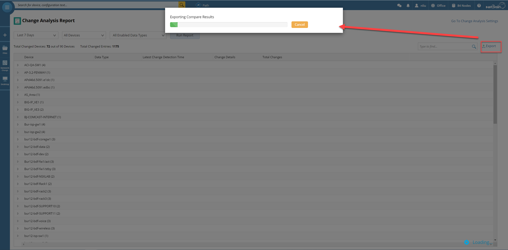
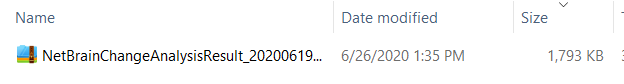
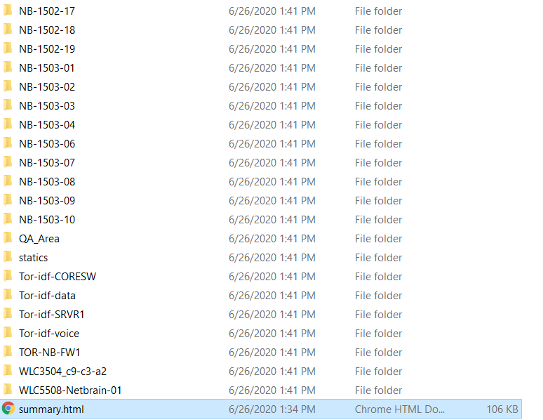
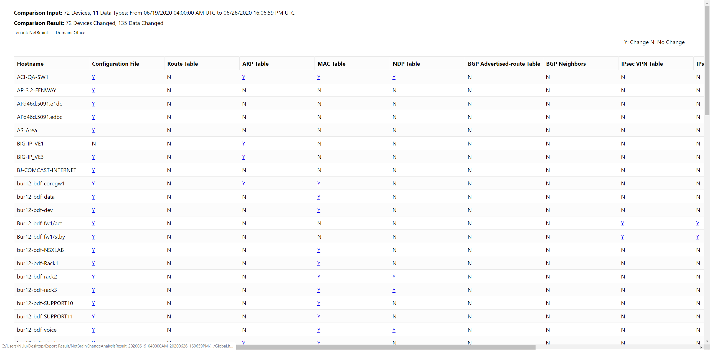
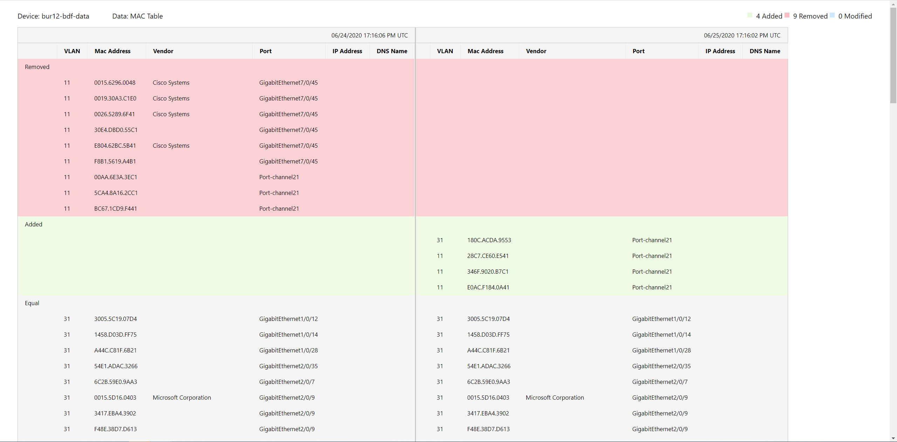

# Network Change Analysis
By using NetBrain Change Analysis, it is much easier to track and acknowledge the changes.

*Version: NetBrain v8.x*

## Use Case

In daily network operation, the easiest way to identify or track the issue is to verify if any config or network table changes, and NetBrain Change Analysis Report is one for the good solution.

## Solution

### 1. Open Change Analysis Report

* Change Analysis report is based on current baseline data, so make sure the `System Benchmark` set up properly.

*To learn more about this, please see: https://www.netbraintech.com/docs/ie80/help/index.html?scheduling--basic-system-benchmark-task.htm*

### 2. Run Analysis Report

* Select filter condition (time range, device scope, data types) to generate the report.

* Search and click the changes to view the change detect time.

* View Detail Compare Result.

*To learn more about this, please see: https://www.netbraintech.com/docs/ie80/help/index.html?configure-ca-settings.htm*

### 3. Export and Archive the Change Results

* If resource shared and archived needed, result can be exported.

* A zip file will be downloaded.

* Please unzip the result, and click the `summary.html` file.

* A local change analysis report with detail change result will be display.

 

### *Disclaimer*
*The solution provided above is developed by testing environment so may not suit to every scenario, please feel free to contact NetBrain Support <Support@netbraintech.com> if any questions related to the solution.* 