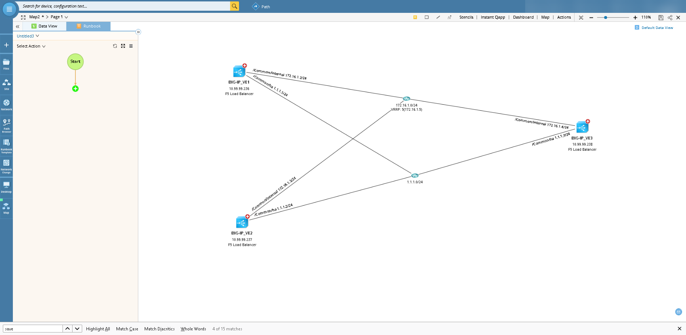
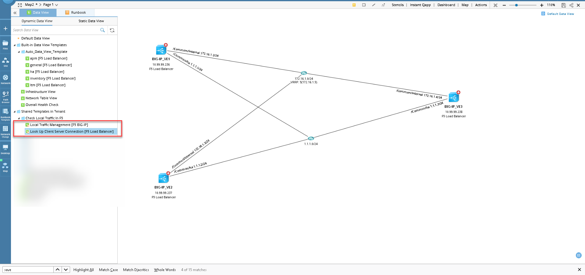
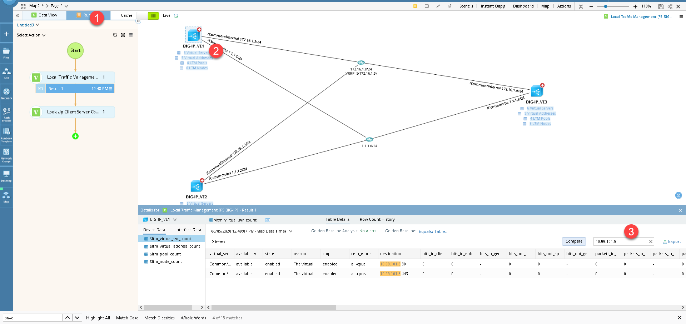
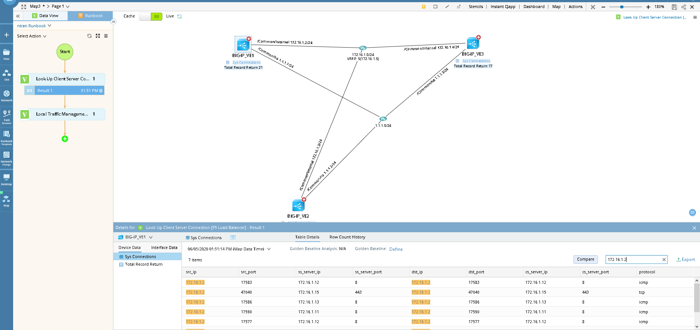

# Check Local Traffic Management [LTM] in F5 Load Balancer
This is a solution to quickly check status of Virtual Servers, Server Pools, Servers, Client Connections, Server Connections 

**Version: NetBrain v8.x**

## Use Case

You want to check overall status of virtual servers, to see whether they are working normally, their server pools are working normally. Or you want to deep dive into server and client connections detail. This runbook, dataviews will  help with the scenerios  


## Solution

### 1. Put the F5s into the map 

You could use any existing maps, search for F5 devices in the search bar, etc. 

### 2. Execute the DataViews
* Double click on the Data View to run. 

## Results
* Once the DVT(s) executed successfully, you can click on each data unit to verify the status of each virtual servers, virtual addresses, server pools, server nodes. If there are many rows, you could type in the search bar to quickly find the results 



* To show sys connections, click on the sys connection data unit. There could be many results, you could type in the ip address in the search bars to find it. Whether you are looking for client side or server side IP, the process is the same.



* All the results are recorded in the runbook. If you save the map, the results are kept to analyze later. Also,  you should consider save them as runbook template so that someone else could use it next time. In this example, I saved my runbook template and uploaded in the Resource below. 
#### Sample Command Output
Following commands was used by the DVTs in this demonstration:

````
show ltm virtual recursive 
show ltm virtual-address recursive
show ltm pool recursive
show ltm node recursive
show ltm node recursive

show sys connection 
````

## Resource
Runbook Download Link: [Check Local Traffic In F5.rbt](resources/Check%20Local%20Traffic%20In%20F5.rbt)

*See the resources folder if the link does not work*

### *Disclaimer*
*The solution provided above is developed by testing environment so may not suit to every scenario, please feel free to contact NetBrain Support <Support@netbraintech.com> if any questions related to the solution.* 

