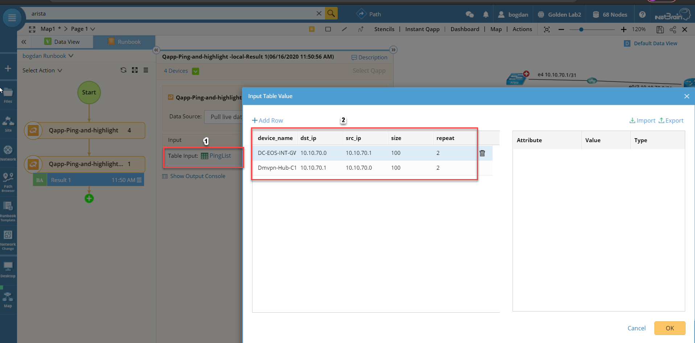
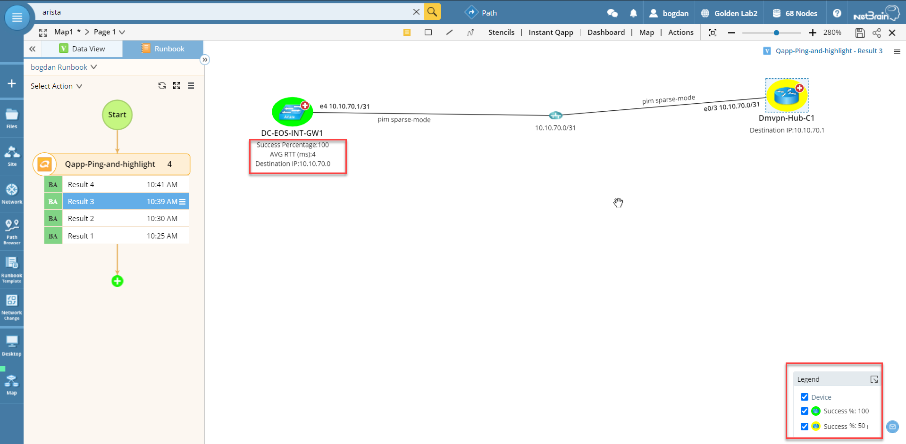
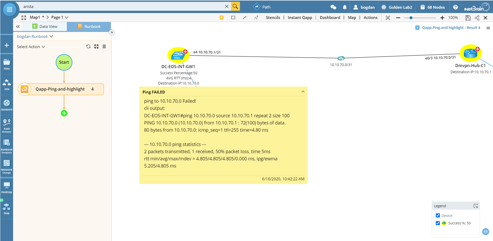

# Extended ping operations
This is an automated solution to check the ping results for a given mtu size between any source and destination IPs discovered in NetBrain (Note: the destination IP does not have to be discovered in NetBrain).

**Version: NetBrain v7.x v8.x**

## Use Case

Extended ping is a very common troubleshooting command during daily operation tasks, and the output is very useful to identify connectivity or IP reachability. 
NetBrain provides a very easy way to visualize the ping results and further troubleshooting steps.

## Solutions

## 1. Extended ping from Live Result

* Click the `Runbook` and select `Ping` action.
* Select `From` device/IP (*From Device `must` in NetBrain Domain*) and then `To` device/ip, then click `Ping` to get live result. You can also select the source and destination Inteterfaces from the drop down list, if devices are discovered in NetBrain. Front servers are also available as the source of the ping from the drop down.

## 2. Extended ping Qapp from Live Result

* import the Qapp (Cisco or Arista)
* Click the `Runbook` and select `Run Qapp` action, then find the ewnly imported Qapp.
* Click on the Table Input: `PingList` and fill out the table with the desired information. Alternatively, import the data from a csv file as shown below.

### 2.1 Checking results

* The results are visible and displayed on the map. Highlight is used to differentiate the success rate. Device units displayed under each device show relevant information (i.e., success rate, averate RTT and destination) as shown below.

* When ping has failed, a device note is attached with the CLI output of the ping command as sown below.

*To learn more about Ping, please see: https://www.netbraintech.com/docs/ie80/help/index.html?ping.htm*

### *Disclaimer*
*The solution provided above is developed by testing environment so may not suit to every scenario, please feel free to contact NetBrain Support <Support@netbraintech.com> if any questions related to the solution.* 

