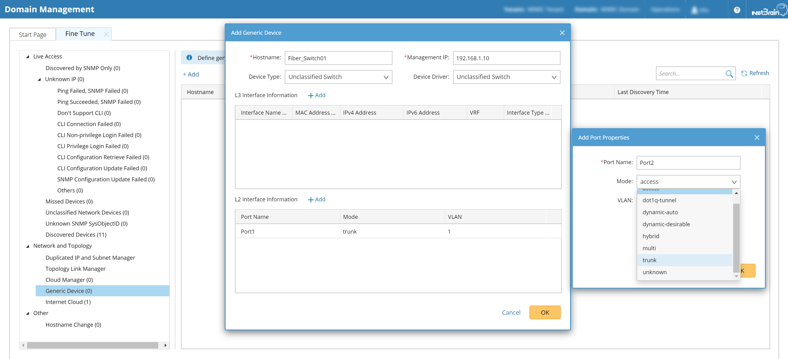
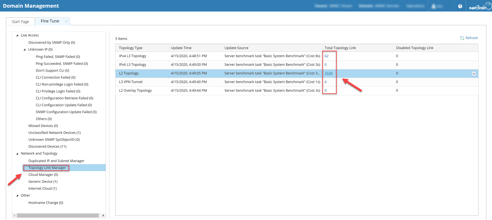
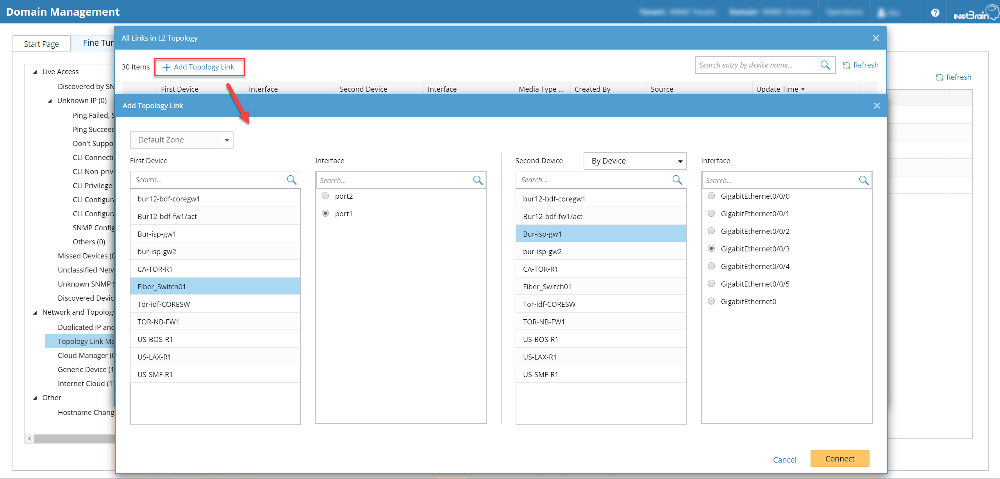
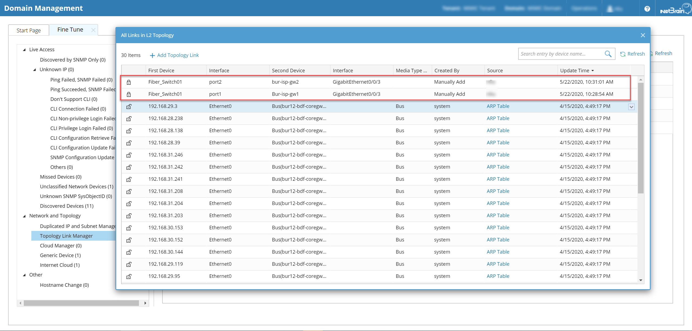

# Create Fiber Connection Map
This is a solution for the customization connection by using NetBrain Dynamic Map and Topology Manager.

**Version: NetBrain v8.x**

## Use Case

Topology is critical for network, but it is really hard to have a central place to update the topology or map. L3 and L2 topology can be detected by using IP address and Neighbor Discover Protocol, but hard to acknowledge the connections like fiber, transparent firewall, etc.

## Solution

### 1. [Create Generic Devices](https://www.netbraintech.com/docs/ie80/help/index.html?undiscoverable-devices.htm)

* Click the `Generic Device` under `Domain Management`.
* Create the device and add links.

### 2. [Add Connections in Topology Manager](https://www.netbraintech.com/docs/ie80/help/index.html?adding-a-topology-link.htm):

* Click the `Topology Link Manager` under `Domain Management`.
* Click the `Total Topology Link` based on the `Topology Type`.

* `Add Topology Link` to create customized links.

* Verify added customized links.

## Results

* Once the domain topology rebuild, the map will update automatically.
* The map can be used for future documentation and troubleshooting.
