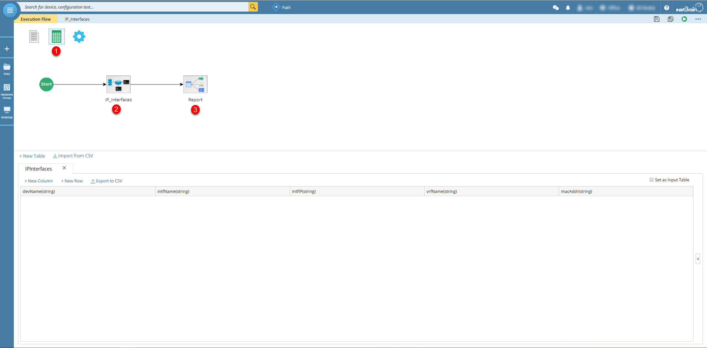
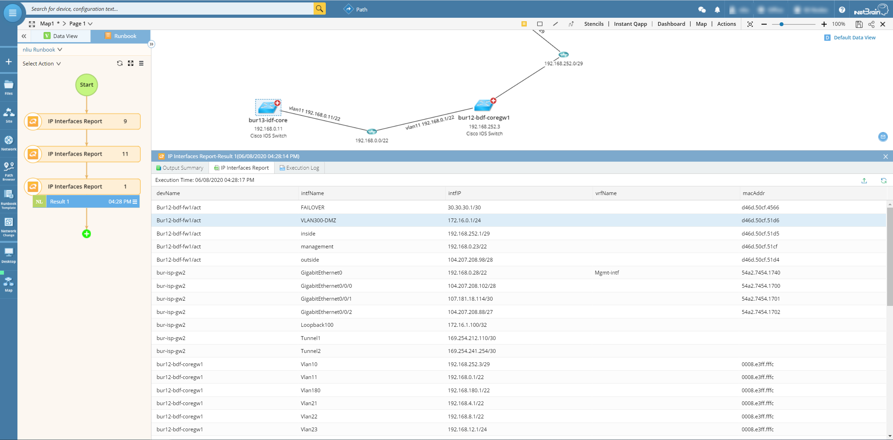

# Get All Interfaces with IP Configured
Use NetBrain database to quickly list all interfaces with IP configured.

**Version: NetBrain v7.x v8.x**

## Use Case

It is very important to understand the interfaces with ip configured, which will help to do daily operation and compliance check.

## Solution

### 1. Create Customized Qapp


* Create a `Global Table` to customized the report data.
* Create a logic Canvas to process data and write into global table

```
# Get All IP Interfaces based on the Qapp Device Queue
for dev in $this:
    intfs = GetInterfacesByDevice(dev, 'intfs')
    for intf in intfs:
        intf_name = intf.Name()
        intf_ip_list = intf.GetProperty('ips')
        vrf_name = intf.GetProperty('mplsVrf')
        mac_addr = intf.GetProperty('macAddr')
        # dev + ' ' + intf_name + ' ' + str(intf_ip)
        # "bur-isp-gw2 GigabitEthernet0/0/1 [{'ip': 1807028850, 'ipLoc': '107.181.18.114/30', 'maskLen': 30}]"
        if intf_ip_list and len(intf_ip_list)>0:
            intf_ip = intf_ip_list[0]['ipLoc']
            # txt = dev + ' ' + intf_name + ' ' + intf_ip + ' ' + vrf_name + ' ' + mac_addr
            # AddMessage(txt,1)
            
            # Add customized data into Global Table
            gdt_row = {'devName':dev, 'intfName':intf_name, 'intfIP':intf_ip, 'vrfName':vrf_name, 'macAddr':mac_addr}
            $IPInterfaces.AddOneRow(gdt_row)
```
* Use table Canvas to export the result as csv report.

*To learn more about Qapp API, please see: https://www.netbraintech.com/docs/ie80/help/index.html?variable-api.htm*

### 2. Execute Qapp to Get Result

* Run the Qapp on demand by using map as input.


## Results


## Resource
Sample Qapp Download Link: [IP_Interfaces_Report.xapp](resources/IP_Interfaces_Report.xapp)

### *Disclaimer*
*The solution provided above is developed by testing environment so may not suit to every scenario, please feel free to contact NetBrain Support <Support@netbraintech.com> if any questions related to the solution.* 

