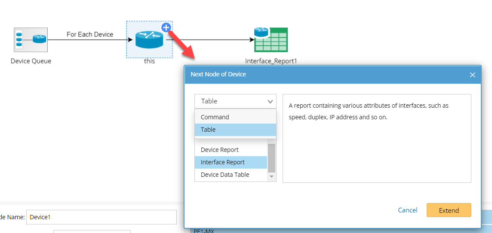
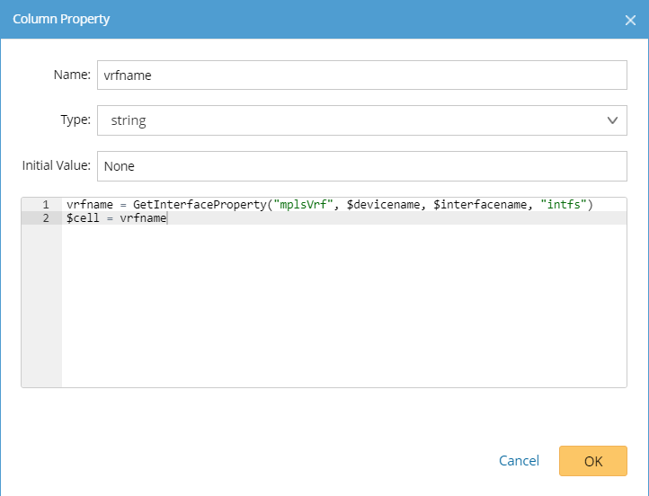
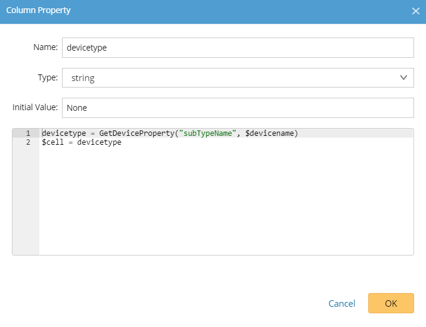
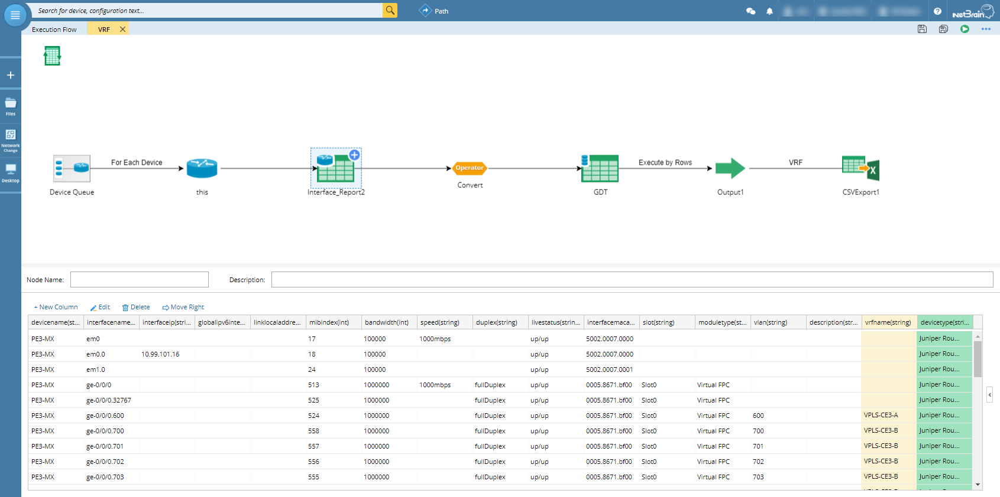
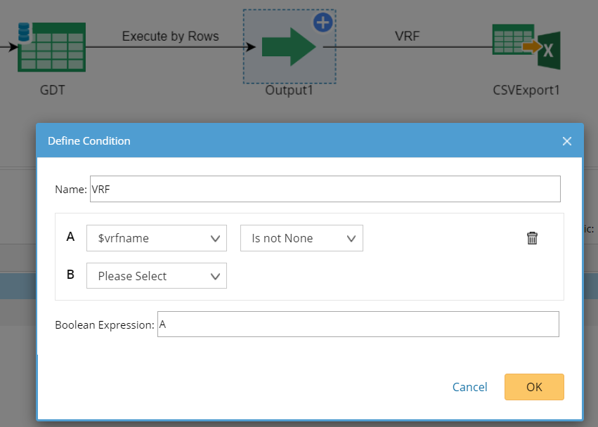
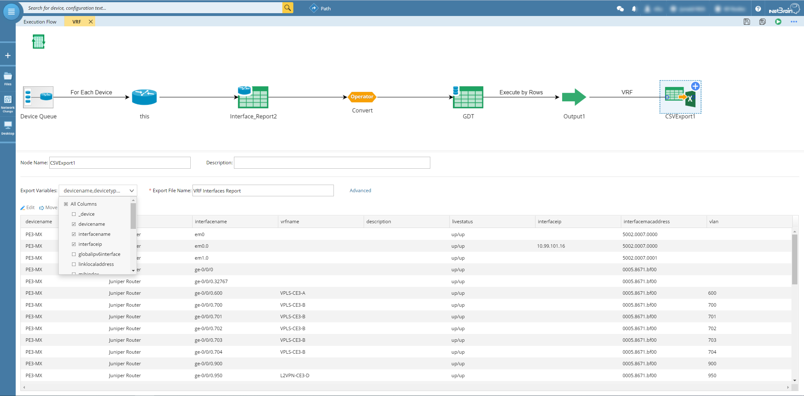
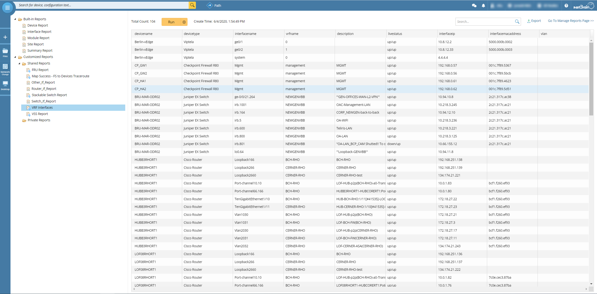

# Identify Interfaces with VRF Configured
By using NetBrain automation application, the interfaces with vrf configured can be easily identified.

*Version: NetBrain v7.x v8.x*

## Use Case

For service provider, it is very important to understand the vrf deployment and architecture, but it is hard to visualize or unified the information easily.
Based on NetBrain benchmark data, using the solution provided below could be a quick way to understand the vrf deployment in the organization.

## Solution

### 1. Create the Qapp based on the benchmark data.

* Use existing interface data table



*For more Qapp Table information, please see: https://www.netbraintech.com/docs/ie80/help/index.html?qapp-table.htm*

### 2. Add Customized Column to enrich the data table

* Add customized column for `vrfname`


```
vrfname = GetInterfaceProperty("mplsVrf", $devicename, $interfacename, "intfs")
$cell = vrfname
```
*For more GDR information, please see: https://www.netbraintech.com/docs/ie80/help/index.html?configuring-gdr.htm*

* Add customized column for `devicetype`



```
devicetype = GetDeviceProperty("subTypeName", $devicename)
$cell = devicetype
```
*For more Qapp API information, please see: https://www.netbraintech.com/docs/ie80/help/index.html?qapp-api-list.htm*

* New Table Report after customized



### 3. Customized the report output

* Set proper condition to filter the result.



* Modify the report based on needs



## Results

* Load the Qapp into Inventory Report
* Run the Qapp and get the result.
* Sort or Export the result.



*For more inventory report, please see: https://www.netbraintech.com/docs/ie80/help/index.html?inventory-report.htm*

## Resource
Sample Qapp Download Link: [VRF_Interfaces_Report.xapp](resources/VRF_Interfaces_Report.xapp)

### *Disclaimer*
*The solution provided above is developed by testing environment so may not suit to every scenario, please feel free to contact NetBrain Support <Support@netbraintech.com> if any questions related to the solution.* 