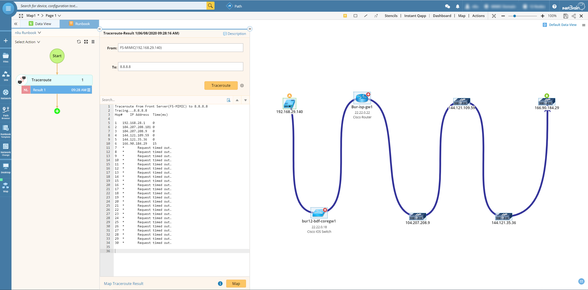
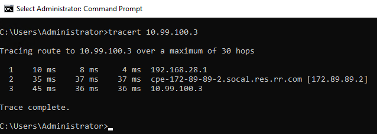
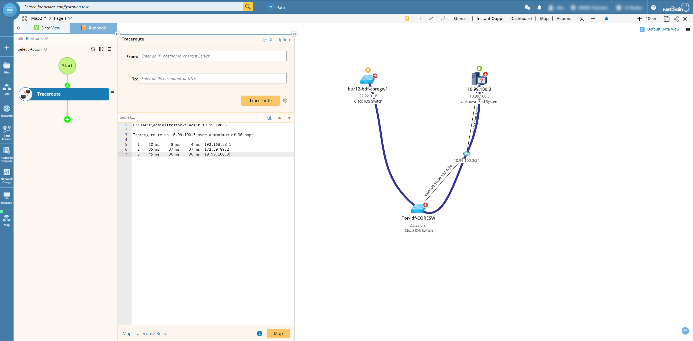

# Visualize Traceroute Result
This is one of the best solution to provide end-to-end visibility by using traceroute result.

**Version: NetBrain v7.x v8.x**

## Use Case

Traceroute is a very common troubleshooting command during daily operation tasks, and the output is very useful to identify connectivity or IP reachability. 
NetBrain provides a very easy way to visualize the traceroute result and further troubleshooting steps.

## Solution

### 1. Map Traceroute from Live Result

* Click the `Runbook` and select `Traceroute` action.
* Select `From` device (*From Devic `must` in NetBrain Domain*) and type `To` device/ip, then click `Traceroute` to get live result.
* `Map` the result and visualize the result on the map.
* For these devices or IPs not in NetBrain domain will show as unknown devices.

### 2. Map Traceroute from History Result

* Get Traceroute result from `Network Device Traceroute`, `Windows Tracert`, `Linux Traceroute`.

* Click the `Runbook` and select `Traceroute` action.
* Copy the `raw result` and paste into the Runbook, and click `Map`
* The DNS name is not fully support, so pls remove DNS name if not work properly.

*To learn more about Traceroute, please see: https://www.netbraintech.com/docs/ie80/help/index.html?traceroute.htm*

## Results

### *Disclaimer*
*The solution provided above is developed by testing environment so may not suit to every scenario, please feel free to contact NetBrain Support <Support@netbraintech.com> if any questions related to the solution.* 

