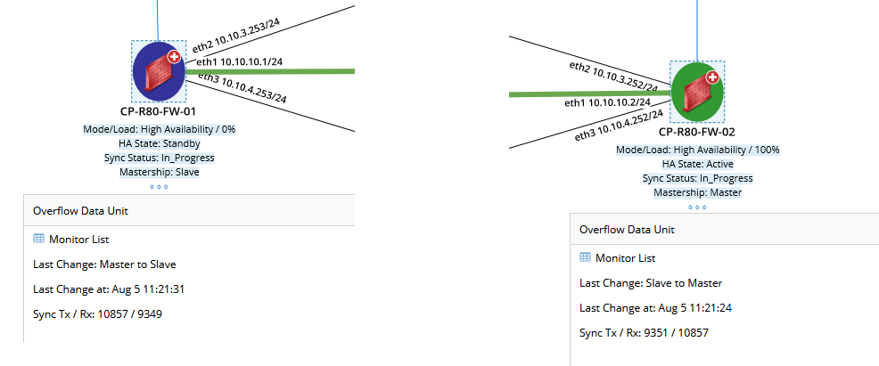

# High Availability Visibility for Check Point Firewalls
This Data View Template (DVT) shows relevant high availability information for Check Point firewalls.

**Version: NetBrain v8.x**

## Use Case
Visualize all relevant information for firewalls configured with high availability. Being able to quickly identify HA status, details, health and statistics directly on a map for each firewall.

## Solution

### 1. Map your devices and run the DVT
* Map the Check Point firewalls and double click the DVT to run:

  


## Results
* The HA information will be displayed for each device on the map: device data units showing relevant HA information; three dots indicate that more data units are available **(1)**; device note containing HA details **(2)**; if you click on a device unit, you can see historical information for that device unit **(3)**; map legend shows a summary of device and interface highlights **(4)**:

  


* A closer look at the device data units:

  


* A closer look at the device note:

  


## Commands Used

Following Cli commands are used in this DVT:

```
cphaprob -a if
cphaprob -l list
cphaprob state
fw ctl pstat
show routed cluster-state detailed

```


## Resource
DVT Download Link: [HA [CheckPoint FW].xdvt](resources/HA%20[CheckPoint%20FW].xdvt)


*To learn more about this, please see: https://www.netbraintech.com/docs/ie80/help/index.html?data-view.htm*

### *Disclaimer*
*The solution provided above is developed by testing environment so may not suit to every scenario, please feel free to contact NetBrain Support <Support@netbraintech.com> if any questions related to the solution.* 