# Multicast Infrastructure Mapping Solution

## Background

This Multicast mapping Qapp give users the possibility of identifying all devices within their domain that have a specific multicast state present and to map and visualize that Shared / SPT (shortest path tree).

**NOTE:** _This solution will work on VPN and non VPN environments, depending on the deployment and design of the network._

## Multicast terminology and information

Extensive information regarding Multicast terminology and concepts can be found here:

[Cisco Multicast Documentation](https://www.cisco.com/en/US/tech/tk828/tech_digest09186a00801a64a3.html)

## Use Cases

Troubleshooting multicast environments (specially large ones) can be time consuming and challenging, specially if there are multiple strings or if there are customer and provider multicast involved.
The solution has been thought and designed around the possibility of potentially dealing with this kind of mVPN / non-mVPN environments that use most commonly deployed methodology Rosen VPN / SSM / ASM Models, which could also involve the use of default multicast distribution tress for signalling.

## Testing Topology

See below the testing topology for the proposed solution:

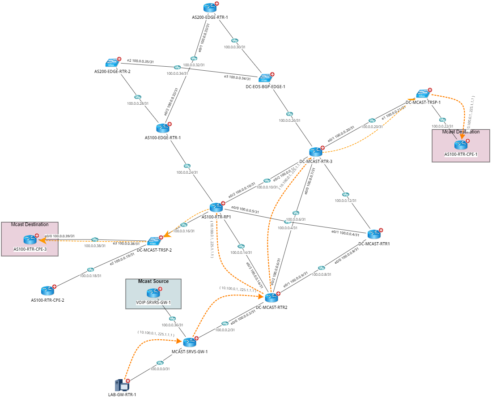

**Note:** _In order for this to be able to be tested properly, sources must be generating the multicast traffic to their respective groups. There is a static join from each destination that always query for the traffic._

- Source 10.100.0.1 must ping to 225.1.1.1 (can also ping 226.1.1.1)
- Source 10.100.0.3 must ping to 226.1.1.1

## Solution and Support

The reference solution provides support for multi-vendor platform including:

- Cisco IOS Switch
- Cisco Router
- Cisco IOS XR
- Cisco Nexus Switch
- Arista Switch
- Juniper EX
- Juniper Router

## How does this solution work and what manual tasks does it help expedite?

This solution basically consists in 2 different Qapp executable files, Multicast Infra report MVS.xapp and Draw Multicast Tree Topology for SG.xapp.

_In order for this solution to provide accurate results, the first Qapp needs to run on the **ENTIRE** multicast infrastructure base (this means, on a device group that contains all the multicast enabled devices).
That being said, if such group does not exists, it is required to be created._

Creating a device group:

1. Access the device group manager from the start menu
   
   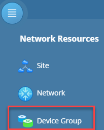

1. Select the desired folder where to locate this new group
   
   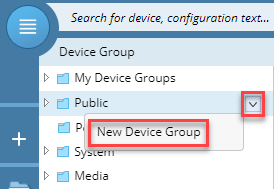

1. Enter a group name, a description if required and select \"Dynamic Search Device\" from the Dynamic search drop down menu
   
   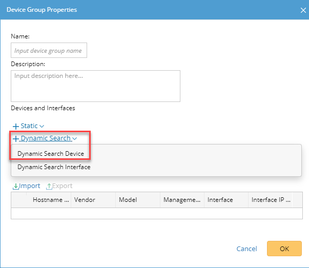

1. Then select all the devices running multicast or that are \"Multicast Enabled\"
   
   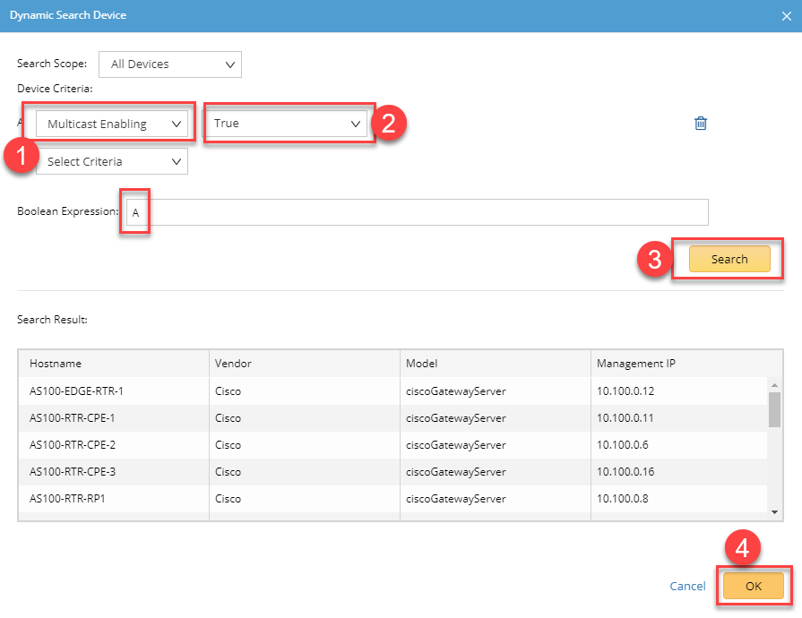

_Once the device group has been created, now the base for this solution to work has been set._

**Running the first Qapp:**

It has to be executed on the entire multicast infrastructure device group, on which it will identify only the devices on which a specific multicast state will be present (**THIS INPUT IS REQUIRED FOR THE QAPP TO RUN**). This means, from the entire multicast domain, all devices containing routes for a specific group or string (S, G) will be pulled into the report.

Example:

1. Click on the green drop down menu
2. Click \"More Devices]"
3. Select device group
4. Select the device group created as indicated above on this article
5. Move all the devices on the reference group to the selection area by clicking on the \">>" button
6. Click OK
7. From the drop down menu select \"Pull live data once\"
8. Enter the source and destination group to get verified

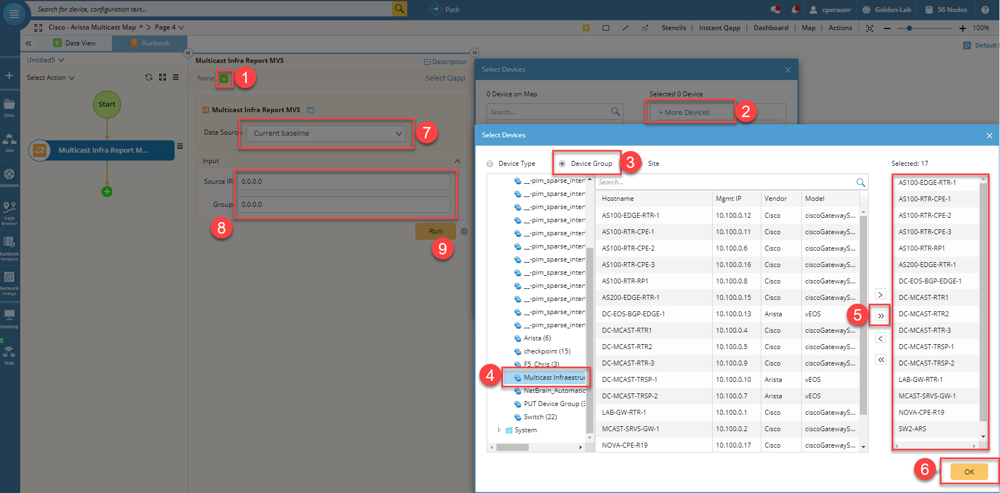

## Resutls of first QAPP

The results for the reference Qapp will provide a report of all the devices that currently hold a multicast state (or route) present for the reference pair as defined on the run time input.
Along with this state, a list of the inbound and outbound interfaces are going to be also displayed in the report as shown below:

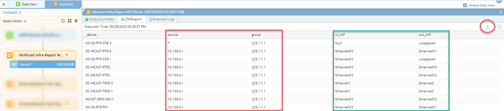

Interface shown on the previous image are going to be mapped per device upon running the second Qapp of the set.

Click on the export button on the top right hand corner of the output results (highlighted).

**Running the Second Qapp:**

This Qapp is straight forward. It only requires to upload the report (csv file) generated by the previous qapp.

**NOTE: There is currently a software bug (currently being investigated), that will generate a blank space in front of each column name on the exported report as shown below:**

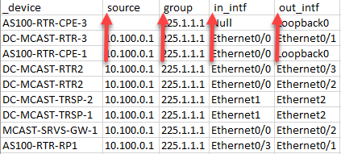

**If this happens, will have to manually remove them until the bug is completely fixed. Moreover, this problem is preventing us to actually generate a single executable as GAPP.**

Perform \"run Qapp\" action in order to bring the Drawing Qapp into the map's runbook instance and only import the report generated by the previous Qapp:

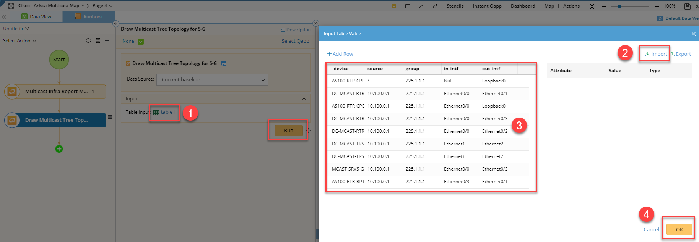

1. Click on Table1
2. Browse and locate the exported report from the previous Qapp
3. Make sure the device table gets populated
4. Click OK

If the following error message appears, means that:

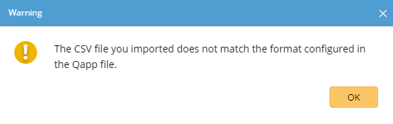

1. There are still column names from the first report export that contains the blank space in front
2. The column name of the exported report does not match the expected column name of the input table
3. You must resolve this in order to continue

If assistance is needed, please do not hesitate to contact NetBrain Support at: support@netbraintech.com

Otherwise, you should be getting a completely and fully Multicast Shared Tree for the provided multicast state as shown below:

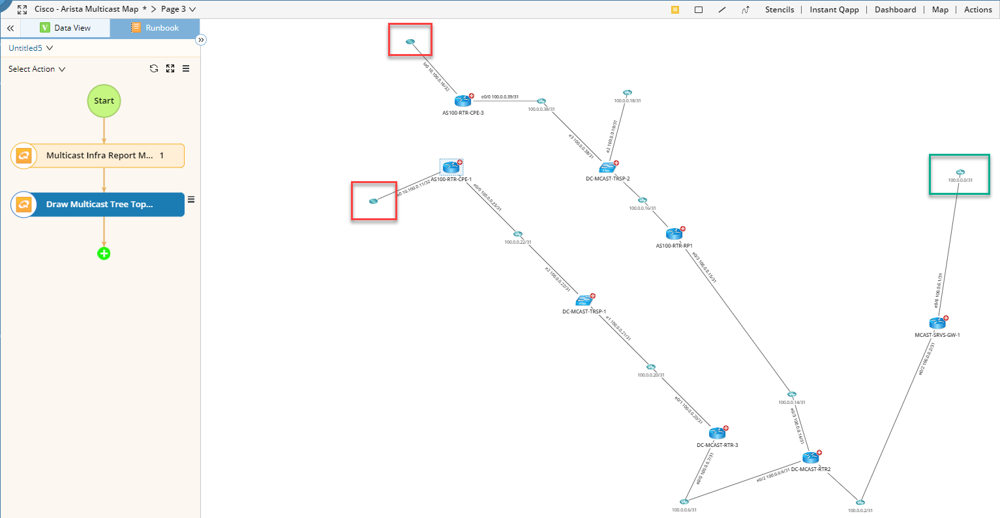

Highlighted in red are the destination devices or multicast requestors and in green the multicast source or sender.

## Final Notes

This solution can be used to either map a Provider multicast tree by simply using the loopback interface ip of the device that we need the source to be and the reference MDT default multicast address as destination.
For non VPN environments, simply use the original Customer unicast source and the real mlticast destination address.