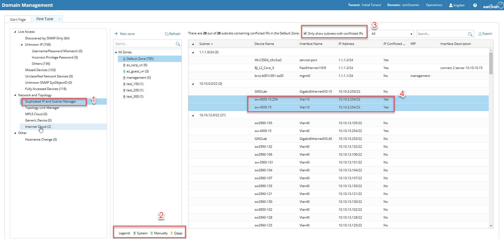
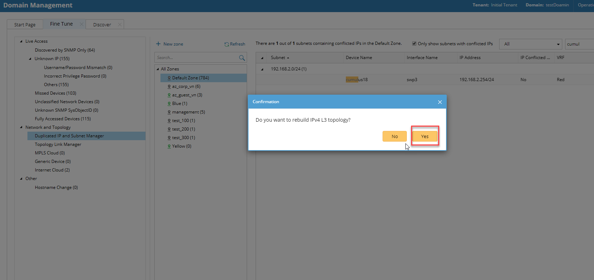
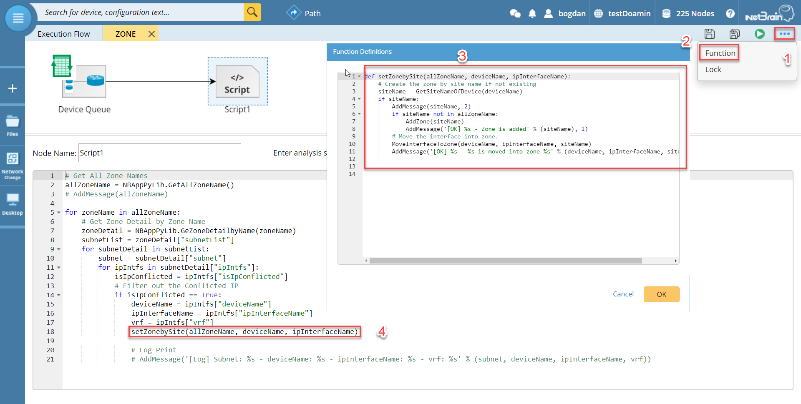

# NetBrain Duplicated IP Solution by GDR

## Summary

This document is created to demonstrate how NetBrain supports L3 network topologies that have duplicate IPs within the same domain. The duplicate IPs refer to the interfaces configured with the same IPv4 addresses. In the following, we present NetBrain’s default functionality when it comes to handling duplicated IPs, how to manually override this functionality and how to automatically make changes using a Qapp. Understanding logic for calculating and displaying the L3 topologies allows the user to customize or create functions within the provided Qapp specific for his own environment. A couple of use cases are presented along with FAQs at the end.

## Duplicated IPs in Netbrain – Default Functionality
During the live network discovery, the system parses the VRF and IPv4 address for each interface and deals with the interfaces of duplicated IPs as follows:  
* If two interfaces are configured with the same IP address, but with different VRFs, then two zones named after the VRFs will be created automatically after the IPv4 L3 topology is built, and these two interfaces will be moved to the corresponding zone according to its configured VRF. The system automatically performs this operation by default. To disable it, go to the Domain Management page, click Operations, point to Domain Settings, select Advanced Settings, and uncheck the Automatically create zones and assign VRF interface based on VRF names option.
* If two interfaces are configured with the same IP address, but without VRFs configured, these two interfaces will be moved to the Default Zone. If there are multiple IP interfaces residing in the same zone (default or otherwise) then only one instance will be set to active. All other interfaces within the same zone will be disabled. 

Note: Zones are used inside NetBrain to extend the IP namespaces. The main purpose of Zones is to handle the logical separation of L3 interfaces with duplicated IPs. The zone concept is transparent to the end user; only the administrators can have access to zone creation and maintenance.
The Default Zone is auto-generated in each domain by the system to store interfaces in IPv4 L3 topology by default. It can neither be renamed nor deleted.
After the interfaces with duplicated IPs are moved into different zones, all duplicated IPs can be involved in IPv4 L3 topology link calculations. When you extend IPv4 L3 neighbors, all calculated links can be displayed on the same map page.

## Zone Management
Zones can be created manually or automatically using a Qapp based on the need determined by different use cases (see example use cases below).
### Manual Zone Definition/Editing
Users can view the zone in the system and its assigned interface in the Domain Management ->Fine Tune->Network Topology -> Duplicated IP and Subnet Manager (1). Legend shows three types of zones: System created, manually created and Qapp (2). Inside the duplicate IP and subnet manager each zone will group the interfaces inside subnets containing info like parent device, IP and interface description. By checking the “Only show subnets with conflicted IPs” box (3), you can filter out the subnets without any duplicate IPs. Users can either search for specific interfaces, IPs or any of the other fields in the table.

<mark>To separate two interfaces with duplicate IPs, you must create a zone (manually or using a Qapp). Second step is to move one of the interfaces and its neighbor interface into the created zone, and finally rebuild the IPv4 L3 topology (see image below). This method assumes that you know which is the neighboring interface(s). </mark>

Note: As L3 topology calculations are done for each zone individually, you must consider that L3 connections between interfaces in different zones are NOT enabled/calculated. As a result, connecting interfaces must always reside in the same zone, default or otherwise. 

### Interface Creation and Zone Assignment using Qapp
The Qapp provided by Netbrain is scripted in a modular structure in order to support not just a default use case of separating IP interfaces into different zones based on the device site identity but also further upcoming use cases (e.g., rack separation, separation based on device naming schemes etc.).

First part of the Qapp iterates hierarchically through all the zones, all the containing subnets, and each interface entry in order to filter and retrieve 3 key variables for each duplicated IP: deviceName, IpInterfaceName and allZoneName (list of all zones). Using these variables, we can achieve any interface zone mobility for all foreseen use cases.

In the following we will present the default use case where IP duplication occurs due to private subnet reuse in different sites. Due to the modular structure, different functions can be created according to the requirements. 

## Default Use Case: IP interface separation based on Site
<mark>An important prerequisite before running the Qapp is to make sure all devices are assigned to the correct site.</mark> To create and assign devices into different sites use the Site manager as presented here:

https://www.netbraintech.com/docs/ie80/help/index.html?site-manager.htm 

<mark>A function setZonebySite(allZoneName, deviceName, ipInterfaceName) is defined which takes as input the 3 variables deviceName, IpInterfaceName and allZoneName.</mark> The first step is to retrieve the site name for each individual device using the python API GetSiteNameOfDevice(deviceName). If there is no zone using the same site name already existing, then a new zone named after the device site is created and the interface with IpInterfaceName is moved to this zone.

Note: According to the number of devices in the domain, the run time of the Qapp can last up to an hour. 

<mark>After the Qapp has finished, run the benchmark task to rebuild the L3 topology for the entire domain.</mark> 

## Frequently Ask Questions 
1.	On which map or device group should I run the Qapp?

* The Qapp does not take into account any device or map that it is running on, instead it iterates through all zones and interfaces in the Duplicate IP and Site Manager Table.  
2.	How do I verify the correct operation of the Qapp? 

* While the Qapp is running, check the live logs and follow messages “[OK] $ZoneName - Zone is added” and “[OK] $DeviceName- $IntfName is moved into zone $ZoneName” for correct assignment. Also check for any tracebacks or error messages in the log which can indicate unhandled exceptions or bugs.
3.	How do I assign interfaces into zones based on different use cases (e.g., device naming schemes or rack placement etc.)

* Simply create a new function following steps 1-3 inside the Qapp:

Based on the 3 input variables allZoneName, deviceName, ipInterfaceName and using the python API ( https://www.netbraintech.com/docs/ie80/help/index.html?qapp-api-list.htm ) you can retrieve and make any zone transfers based on your custom logic and use case needs.
Once you have defined your function simply call it here (4) and replace the default one.

