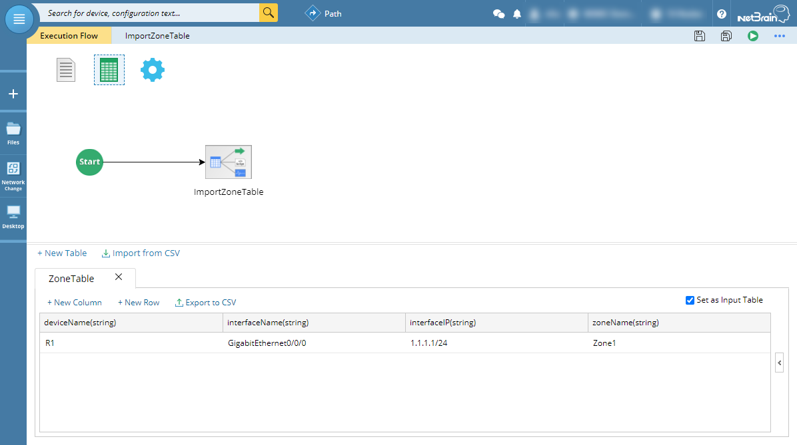
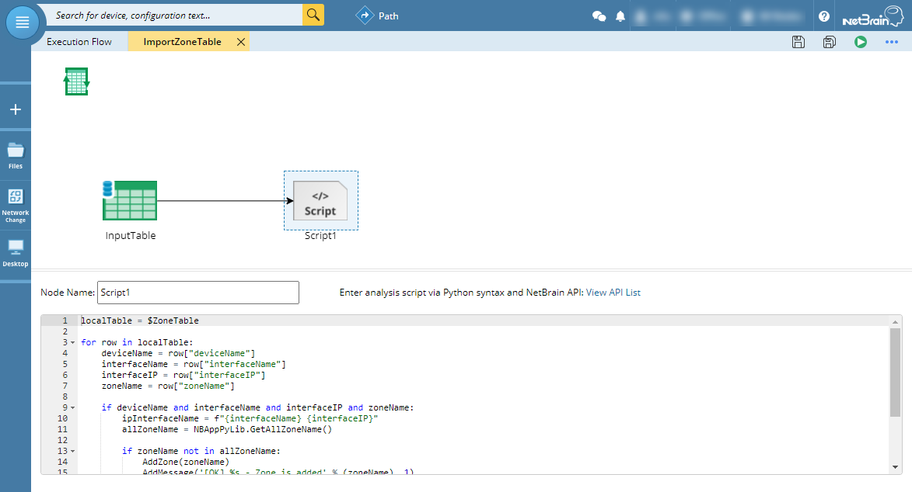
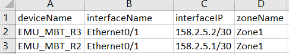
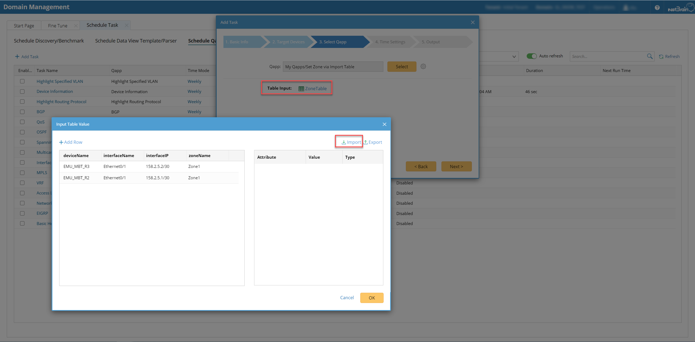
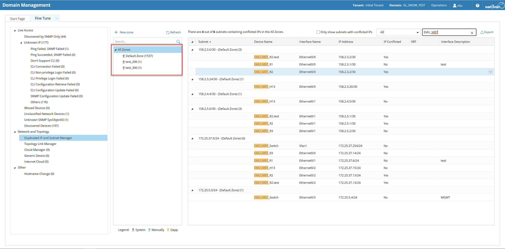
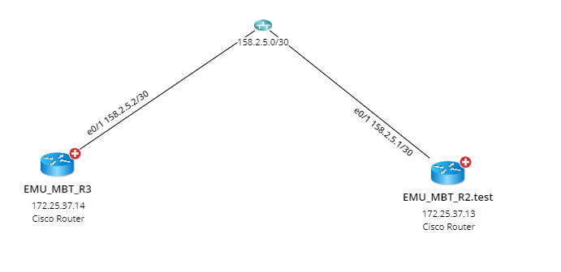
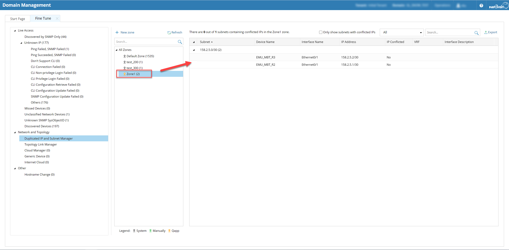
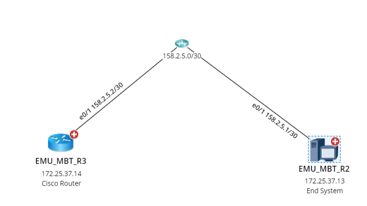

# Duplicate IP Solution by Import CSV
This is one of the solution to set up logic zone automatically to help clean duplicate ip.

**Version: NetBrain v8.x**

## Use Case

NetBrain Path function is based on topology, so to fix duplicate ip under domain management is necessary. From UI, NetBrain allows to manually create Zone to separate duplicate ips but too much works based on network size, so this import csv solution is introduced to automate the manual process.

*To learn more about duplicate ip clean up, please see: https://www.netbraintech.com/docs/ie80/help/index.html?duplicated-ip-and-subnet.htm*


## Solution

### 1. Create Qapp with CSV as Input

* Create customized input table template under `Global Table`.
* Check `Set as Input Table` to allow CSV as input.



* Based on the input table, create Zone and assign the proper device interfaces via NetBrain python library.



```
localTable = $ZoneTable
allZoneName = NBAppPyLib.GetAllZoneName()

for row in localTable:
    if row["deviceName"] and row["ipInterfaceName"] and row["zoneName"]:
        if zoneName not in allZoneName:
            AddZone(zoneName)
            AddMessage('[OK] %s - Zone is added' % (zoneName), 1)
        MoveInterfaceToZone(deviceName, ipInterfaceName, zoneName)
        AddMessage('[OK] %s - %s is moved into zone %s' % (deviceName, ipInterfaceName, zoneName), 1)
    else:
        error_log = "Please check the input table, some data missing! " + str(row)
        AddMessage(error_log, 2)
```
*To learn more about NetBrain python API, please see: https://www.netbraintech.com/docs/python-api/namespaces.html*


### 2. Define the CSV and schedule the Qapp

* Use this [sample csv](resources/TableInput_ZoneTable.csv) to define your own zones and device interfaces in the table.



* Schedule the Qapp under the Domain Management. The target devices can be anything because the Qapp only read from the CSV.



*To learn more about scheduling Qapp, please see: https://www.netbraintech.com/docs/ie80/help/index.html?creating-a-qapp-schedule.htm*

## Solution Summary
Verify with Topo connections

* Before use the solution, `R3` connected with `R2.test`.





* After deploy the solution, `R3` connected with `R2` based on the Zone assignment.





*If topo still not updated, pls manually rebuild l3 topo to update connections, please see: https://www.netbraintech.com/docs/ie80/help/index.html?rebuilding-topology.htm#m*

[Sample Qapp Link](resources/Set%20Zone%20via%20Import%20Table.xapp)

### *Disclaimer*
*The solution provided above is developed by testing environment so may not suit to every scenario, please feel free to contact NetBrain Support <Support@netbraintech.com> if any questions related to the solution.* 

