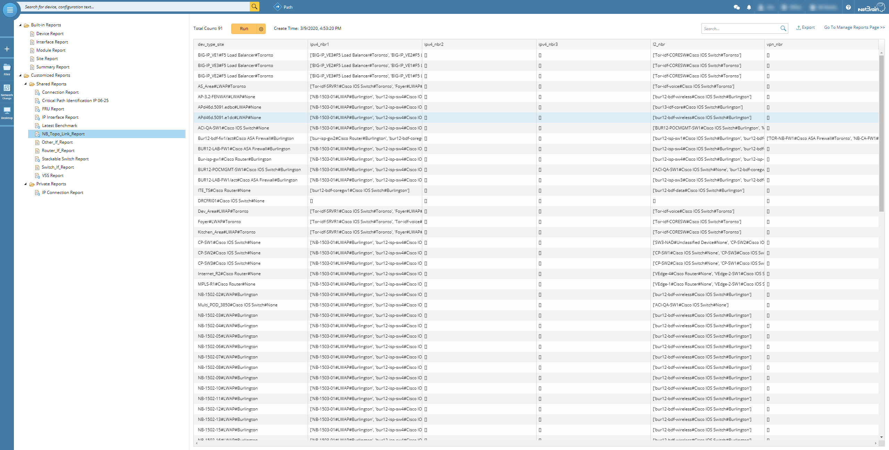
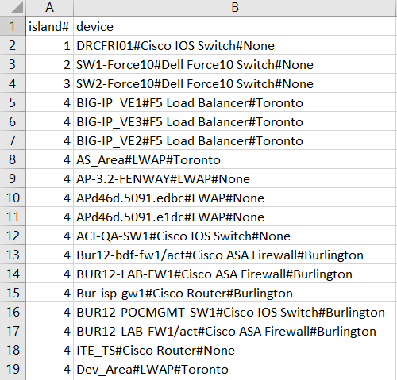
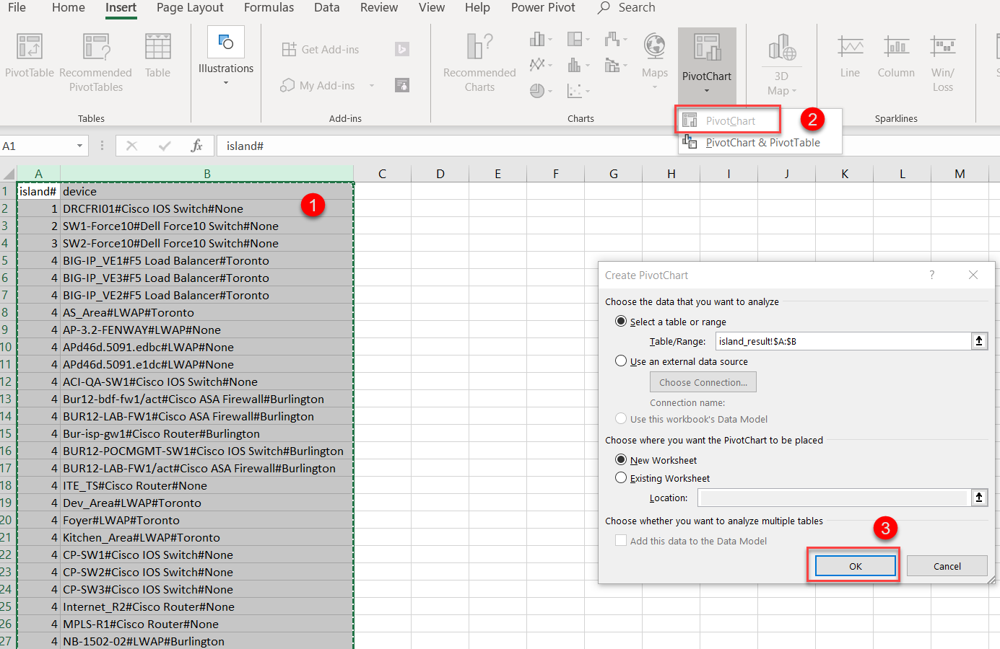
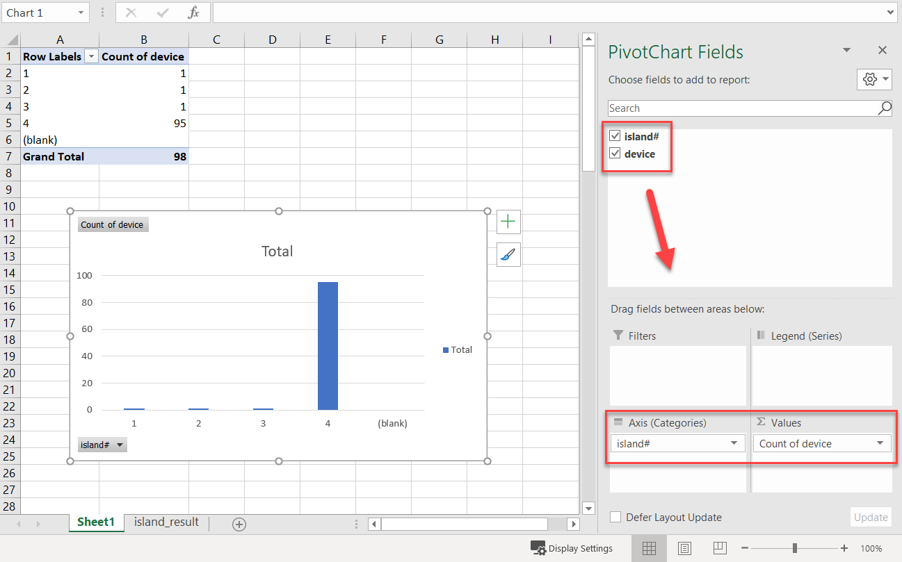

# Identify Domain Network Island
This is the solution to identify how many network islands within NetBrain Domain, and can be used as network architecture baseline to improve the topology.

**Version: NetBrain v8.x**

## Use Case

In an organization, it usually has just `One Network Island`, because all the network nodes should connected physically or logically. NetBrain is able to discover your network and build the topology based on L2/L3 connection data, but due to live access, platform driver, or other issues may cause part of topology inaccurate. To better understanding about the topology overview, number of network islands in domain is one of critical parameters.

*To learn more about domain topology, please see: https://www.netbraintech.com/docs/ie80/help/index.html?topology-management.htm*


## Prerequisite
### 1. Python3

* Please check https://www.python.org/downloads/ to download and install python 3.x.

### 2. Extra python library
* To execute the tool, here are the extra modules need to be installed:

```
import requests
import json
import csv
import networkx
import sys
```
* you can use `pip install [Moduel Name]` to install, or you can use this packed [setup.bat](resoruce/setup.bat) file to install.

### 3. Download Automation Resource
* Qapp: [Topo Link Manager [Report]](resource/)
* Python Script: [island_discover.py](resource/)

## Solution

### 1. Collect Domain Topo Data via Qapp

* Create a report under `Inventory Report` using Qapp `Topo Link Manager [Report]`
* Run with `Current Baseline` and `Export` report as `CSV` to local.



### 2. Get Island information via script

* Copy the exported csv file to the **same** folder of python script.
* **Rename** the csv file to `nb_topo.csv`
* Execute the python script.

*(Tips: please save CSV as CSV UTF-8 format to avoid any exceptions)*
```
[Sample command in Windows OS]
C:\Users\Desktop\Jump Start\Customers\Island_Discover>python island_discover.py
```

### 3. Analysis the Result

* After the python execution, there will be two results generated to do further data analysis: `island_result.csv` and `island_result.json`. And  `island_result.csv` will be used as major data source for this documentation.

* **Open** `island_result.csv`, and preview the raw data. The first colum is the number island, and the second colum is the device in the island. **Example:** In island#1 has 1 device, and in island#4 has more devices.



* Use `PivotChart` to analysis the result better.





### 4. Follow Up
Once the network island information has been retrieved, it will guide you which part need to be connected or fixed. Here are some resources can help self-troubleshooting:

#### 1. Online Help: https://www.netbraintech.com/docs/ie80/help/index.html?building-domain.htm

#### 2. NetBrain University: https://www.netbraintech.com/support/live-training/

#### 3. NetBrain Support: please feel free to contact NetBrain Support <Support@netbraintech.com> for advanced assistance.

### *Disclaimer*
*The solution provided above is developed by testing environment so may not suit to every scenario, please feel free to contact NetBrain Support <Support@netbraintech.com> if any questions related to the solution.* 

