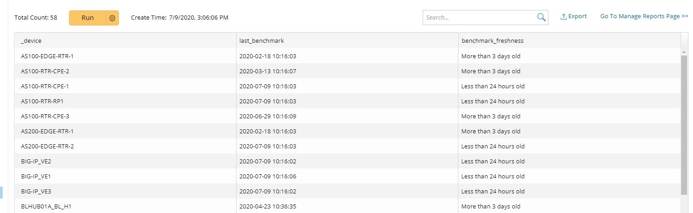

# Verify Benchmark Date

### Background
This Qapp allows a Netbrain administrator to quickly build a report or highlight devices by their benchmark configuration freshness 

**Version: NetBrain v8.x**

### Use Case
This Qapp is intended for Netbrain Administrator to detect devices whose benchmark configuration is 
1. Less than 24 hours old (Green)
2. Between 24 and 72 hours (Orange)
3. More than 72 hours (Red)
4. No configuration exists on baseline for the device (Cyan)   

### Demonstration:

### Sample Report:

### Download links
Qapp: [Verify Benchmark Freshness.xapp](resources/Verify%20last%20benchmark%20date_v3.xapp)

### *Disclaimer*
*The solution provided above is developed by testing environment so may not suit to every scenario, please feel free to contact NetBrain Support <support@netbraintech.com> if any questions related to the solution.* 

<!--
Tags: #search #configuration #qapp #benchmark 
-->

