# Get Today’s Logs From Device
This Gapp provides logging information for the current day by connecting 2 Qapps together in order to extract the required information from the network device.

**Version: NetBrain v7.x, v8.x**

## Use Case

Network devices can generate a very large amount of logs that can go back weeks, even months. When you're interested in analyzing only logs from the current day, it can get messy and tedious, especially when the logs are needed to be collected from multiple devices.

This Gapp will help you collect logs from the current day and show them for each device on the map, just in one simple step.

## Solution

### 1. Create Parsers

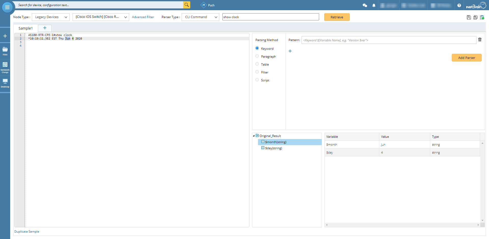
* Create a `CLI Command` parser to get the current date. In this example, we use the "show clock" command for Cisco IOS.

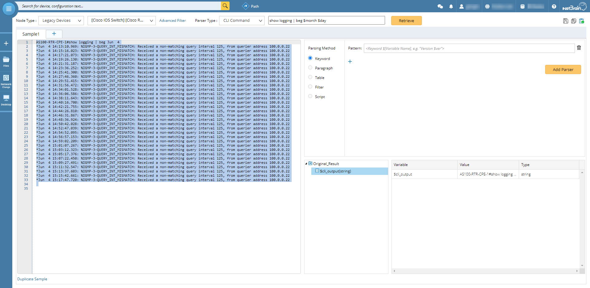
* Create a `CLI Command` parser to get the logs based on a specific date by making use of input variables. In this example we use the "show logging | beg $month $day" command for Cisco IOS.

*To learn more about this, please see: https://www.netbraintech.com/docs/ie80/help/index.html?creating-a-cli-command-parser.htm*

### 2. Create Qapps

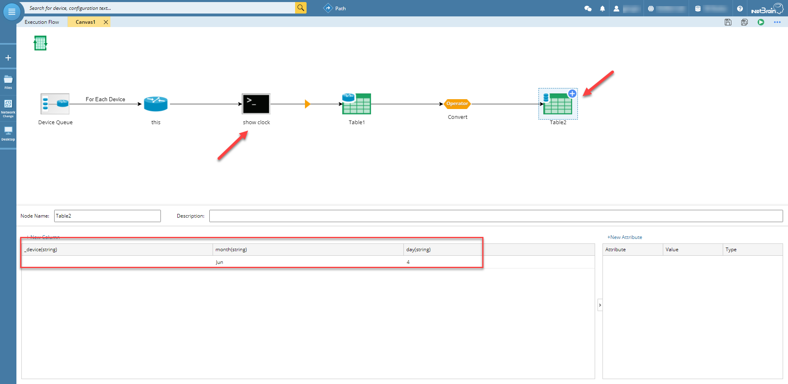
* Create a Qapp that uses the "show clock" parser; the data (month and day) will be put into a `Global Data Table`. We'll name this Qapp "Get Date".

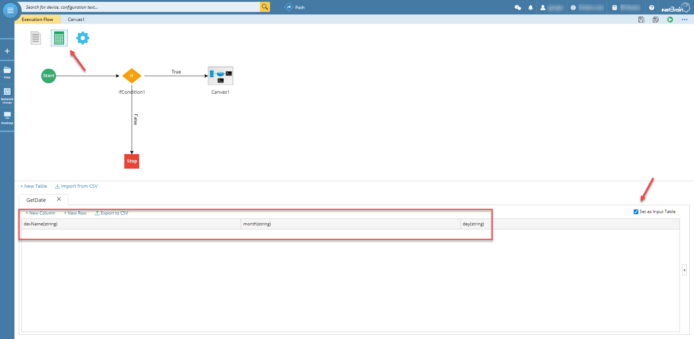
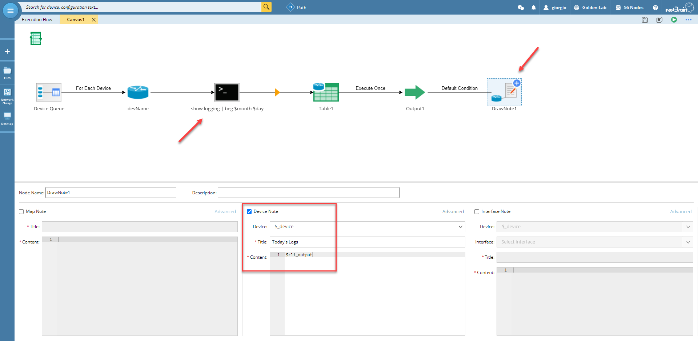
* Create a second Qapp that uses the "show logging | beg $month $day" parser. This Qapp will use a `Global Data Table` as input and will display the results as a device note. We'll name this Qapp "Get Logs".

*To learn more about this, please see: https://www.netbraintech.com/docs/ie80/help/index.html?creating-a-qapp.htm*

### 3. Create Gapp

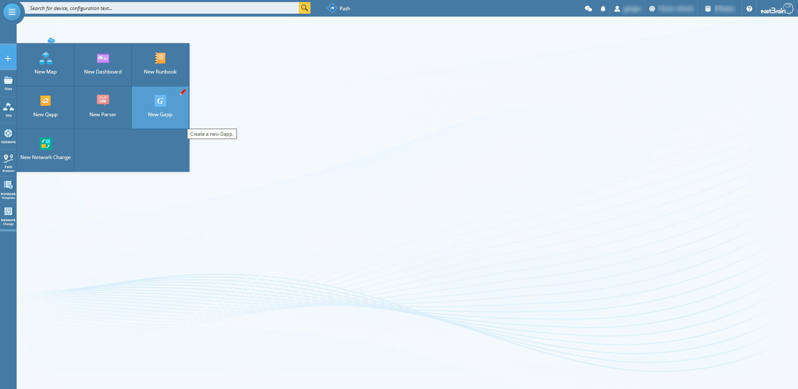
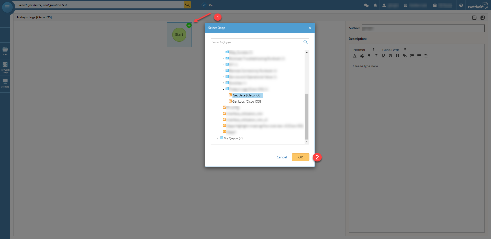
* Create a Gapp and add the "Get Date" Qapp.

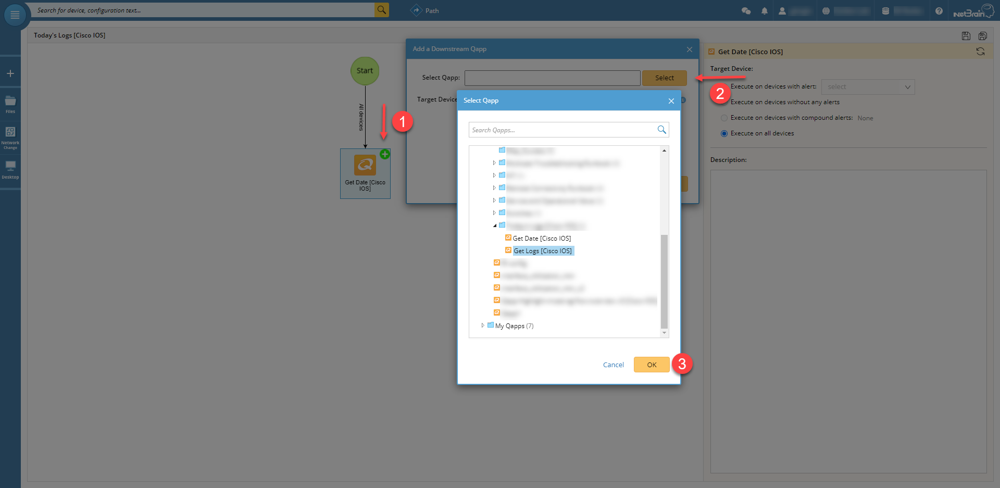
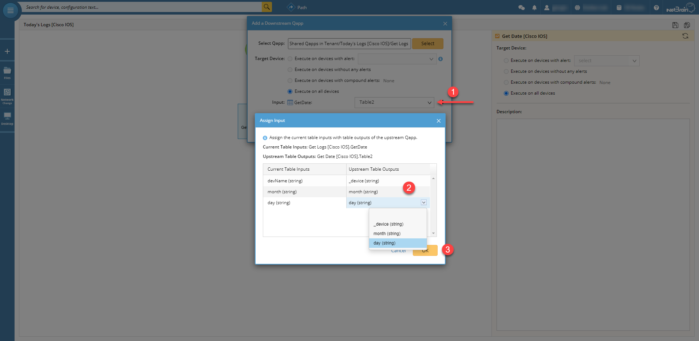
* Add the "Get Logs" Qapp and specify to use the table from the upstream Qapp as input.

* The Gapp is now ready. It will first run the "Get Date" Qapp to collect the month and day; it will then run the "Get Logs" Qapp by using the results from the upstream Qapp and finally generate a device note.

*To learn more about this, please see: https://www.netbraintech.com/docs/ie80/help/index.html?qapp_group.htm*

## Results

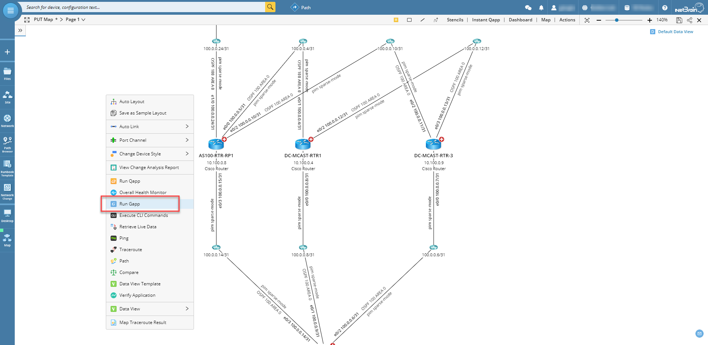
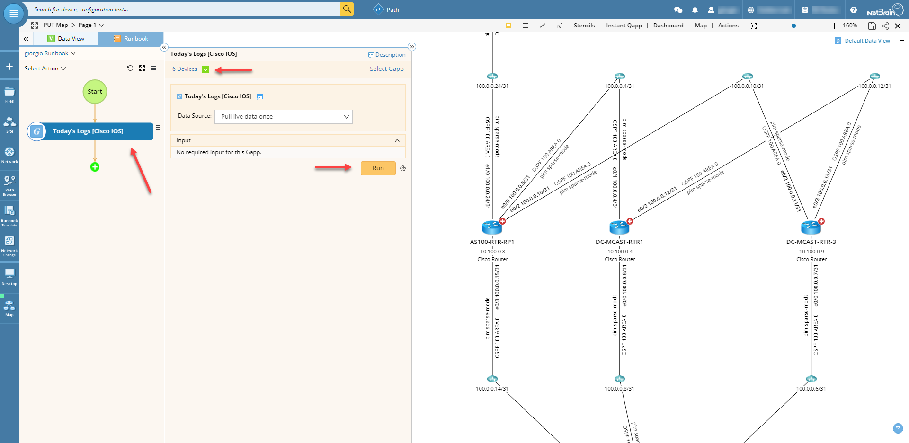
* Run the Gapp by opening a map, right click the white background and select `Run Gapp`. The Gapp will be added to the runbook, select on which devices from the map you want it to run and click `Run`.

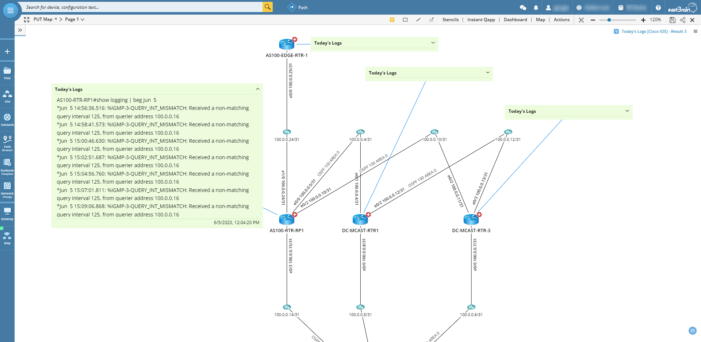
* Each device in the map will have a note showing today's logs.

*To learn more about this, please see: https://www.netbraintech.com/docs/ie80/help/index.html?running-a-gapp.htm*

### *Disclaimer*
*The solution provided above is developed by testing environment so may not suit to every scenario, please feel free to contact NetBrain Support <Support@netbraintech.com> if any questions related to the solution.*

