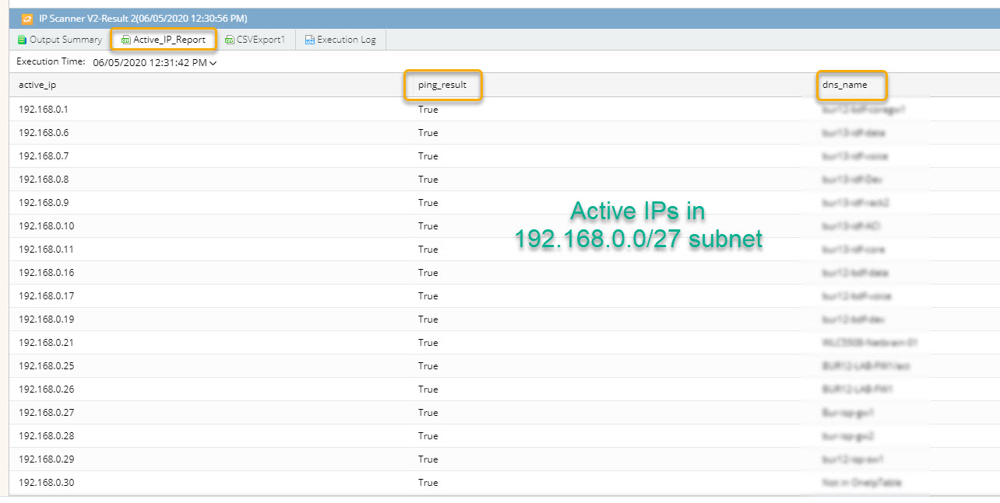

# IP Scanner

### Background
This Qapp pings all the IPs in a subnet (/24 to /31) specified by the user from the Netbrain Front server and generates a report with the DNS name (if available) of the all the IP that responded back to the pings. 

### Use Case
During commissioning of IP addresses it is always a good practice to check for active IPs on the subnet. This Qapp allows the designer/engineer to have a report of all the active IP address on the subnet.  

#### <ins>Important</ins>:  
1. Netbrain Front Server needs to have access to the subnet of interest.
2. Devices needs to have the ability to respond back to ping.

### Sample Active Report:

### Download links
Qapp: [IP Scanner V2.xapp](resources/IP%20Scanner%20V2.xapp)

### *Disclaimer*
*The solution provided above is developed by testing environment so may not suit to every scenario, please feel free to contact NetBrain Support <support@netbraintech.com> if any questions related to the solution.* 

<!--
Tags: #ping #scanner #qapp
-->

