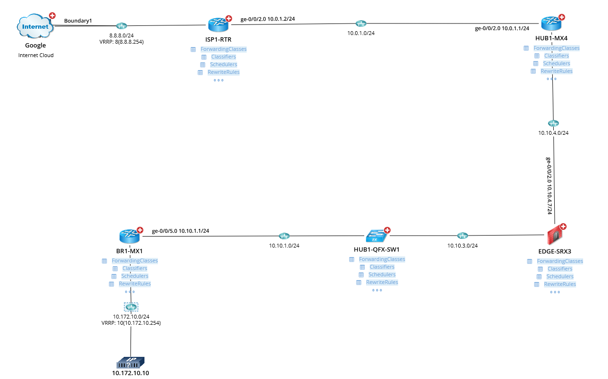

# JUNOS QoS Design and Troubleshooting
This solution provides you a bird's eye view of the overall QoS design of your network containing JUNOS devices as well as aids you in troubleshooting QoS related issues faster.

**Version: NetBrain v8.x**

## Use Case

Quality of Service (QoS) is one of the hardest thing in the network to get right and even harder is its troubleshooting. This solution includes a DVT that will show the most commonly used components of a QoS configuration of a device running JUNOS on the map including the `classifiers`, `schedulers`, `re-write rules` and more. Having this level of visibility across your network in a single map can help you narrow down any potential misconfigurations in the network very quickly. This solution also includes a Qapp that can pin point which egress queue is having any packet drops which speeds up the recovery time.

## Demo Network

To illustrate the use of the solution, we will use the following network. A path is drawn by NetBrain on the map showing the route an end-system at IP address 10.172.10.10 will take while reaching out to a destination on the Internet (8.8.8.8 in this case).

## Solution

### 1. Apply the DVT

Start by adding the DVT "JUNOS QoS Design" in the Runbook:

* Select the `Runbook` tab besides the `Data View` tab.
* Click the `GREEN plus sign`, select `Data View Template` and then navigate and add the DVT to the runbook.
* Make sure the `Data Source` is set to `Pull live data once`. Then `Run` the DVT.
  

## DVT Results

Once the DVT is applied, pertinent information is pulled from devices and overlaid on the map under the devices and on the links:

To see the details, lets zoom in on a couple of devices:

As shown above, we can see straight away that the QoS configurations do not match for the two core devices. Different `classifiers`, `scheduler maps` and `re-write rules` are configured on the two devices. All the devices in the core should have a uniform QoS configuration.

The tables shown under the devices provide further details on these QoS components. Clicking on them will show their configured or default values:

You can also use the search function for any of the tables as per your needs:

### 2. Add Qapp, Set Repeat Count and Run the Qapp

Say you have also received complaints that  the source 10.172.10.10 is experiencing drops while contacting a destination on the Internet (8.8.8.8 in this case). Lets use the Qapp to find out where the packet drops are happening.

* Select the `Runbook` tab besides the `Data View` tab.
* Click the `GREEN plus sign`, select `Qapp` and then navigate and add the Qapp to the runbook.
* Since the Qapp shows the difference (delta) of queue counters, we need to run the Qapp at least twice. So make sure the `Data Source` is set to `Pull live data regularly` and `Repeat` checkbox is selected and the value is at least set to 2. Then `Run` the Qapp.

## Results

Once the Qapp completes execution and if it finds drops, an alert notification will appear besides the Qapp results:

Also, any interface that has drops will be highlighted in `RED` color on the map and there will be a legend in the map's lower right corner:

Zooming in on the highlighted link, we see additional information about the link and its queue counters. These counters represent the delta of the aggregate (sum) of all the counters in each output queue of that interface:

Clicking on any counter on the link will open a window that shows the historical values colleted while the Qapp was performing the iterations specified when it was run:

Clicking on the the first table `Aggregate_Queue_Counters_Delta` under the device shows the same information as overlaid on the link in a tabular format for all the links of the device.

Clicking on the second table `Queue_Counter_Delta` under the device shows similar information about the queue counters but this time lists each queue counter individually instead of showing aggregate values. From this table, we can see that the drops (187 packet drops) we observed on the interface ge-0/0/2 are from the queue number `2`.

To find details about a particular queue, click on the third table `CoS_Information` under the device. This table shows the configuration for various queue applied to device interfaces. We can see that the queue that had drops is associated with the forwarding class `AF` and its bandwidth is being rate limited at `3 kbps` which explains the reason for packet drops as this limit is too low.

You can derive the same conclusion by looking at the DVT table `Schedulers` and searching for scheduler-map `CORE-SCH-MAP` and finding out the configured propertied for the forwarding-class `AF`:

## Final Notes

As demonstrated in this solution, using NetBrain's DVT and Qapp capabilities, you can build powerful automation that can give you the much needed visibility about QoS in your network enabling you to quickly troubleshoot any QoS related performance or connectivity issues.

## Resource
DVT Download Link: [JUNOS QoS Design.xdvt](resources/JUNOS%20QoS%20Design.xdvt)

Qapp Download Link: [Qapp-JNPR-QoS-Counters_v2.xapp](resources/Qapp-JNPR-QoS-Counters_v2.xapp)

Runbook Download Link: [JUNOS CoS Design.rbt](resources/JUNOS%20CoS%20Design.rbt)

### *Disclaimer*
*The solution provided above is developed by testing environment so may not suit to every scenario, please feel free to contact NetBrain Support <Support@netbraintech.com> if any questions related to the solution.* 

<!--
Author: Junaid Mairaj
Tags: #juniper #vpls #qapp

-->