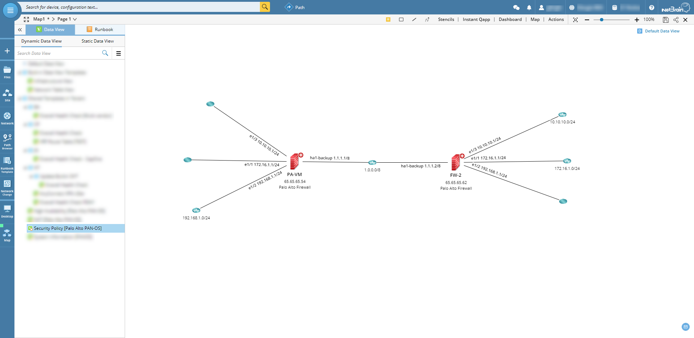
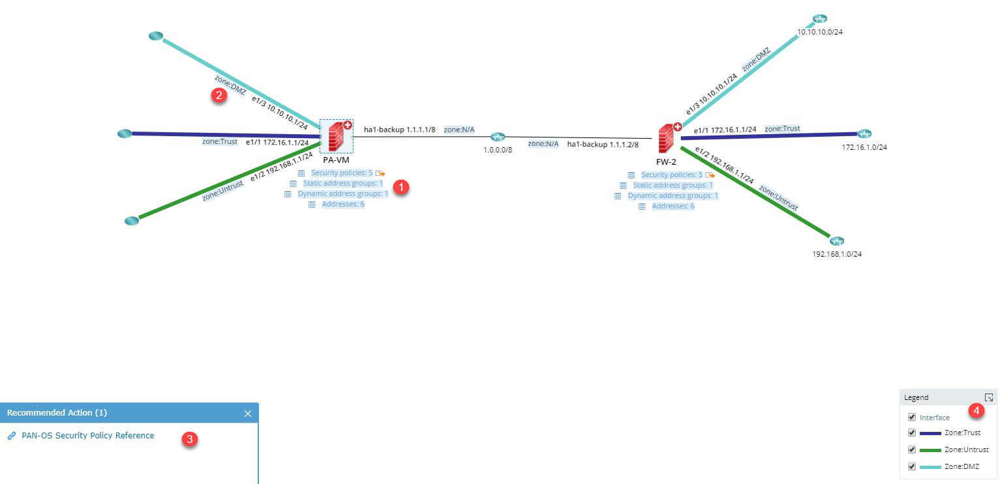
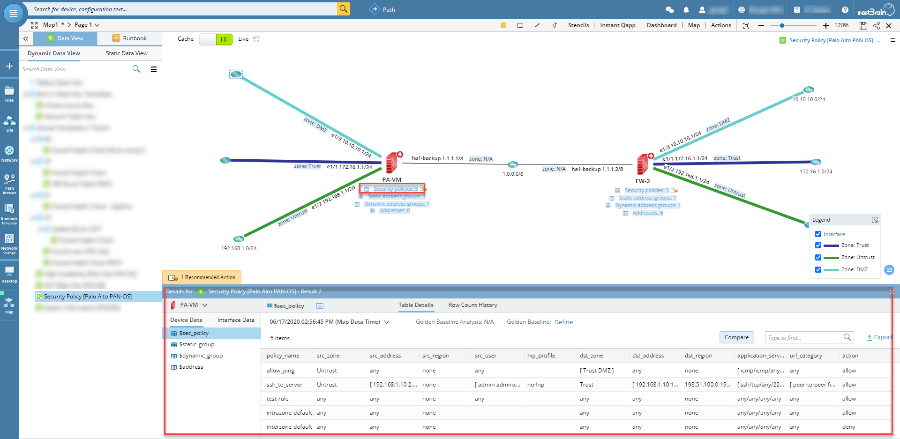
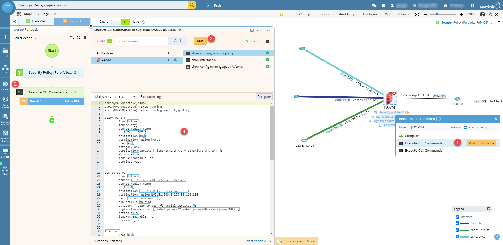

# Display security policy information on map for Palo Alto firewalls
This Data View Template (DVT) shows relevant information about security policies configured on Palo Alto firewalls.

**Version: NetBrain v8.x**

## Use Case
Visualize all relevant information for firewalls configured with security policies. Being able to quickly identify security policies, address groups and zones directly on a map for each firewall.

## Solution

### 1. Map your devices and run the DVT

* Map the Palo Alto firewalls and double click the DVT to run.

## Results

* The security policies information will be displayed for each device on the map: device and interface data units showing relevant information **(1,2)**; map recommended actions with reference security policy documentation **(3)**; map legend **(4)**.

* By clicking each device unit, more details are shown.

* By clicking the drill-down icon next to a device data unit, a list of recommended actions will be displayed. "Execute CLI Commands", for example, will show the CLI commands used to extract data for that specific data unit **(1)**; the action can be added to the Runbook **(2)**; we can run those commands live on the device **(3)** and see the results in the output console **(4)**.

*To learn more about this, please see: https://www.netbraintech.com/docs/ie80/help/index.html?data-view.htm*

### *Disclaimer*
*The solution provided above is developed by testing environment so may not suit to every scenario, please feel free to contact NetBrain Support <Support@netbraintech.com> if any questions related to the solution.* 