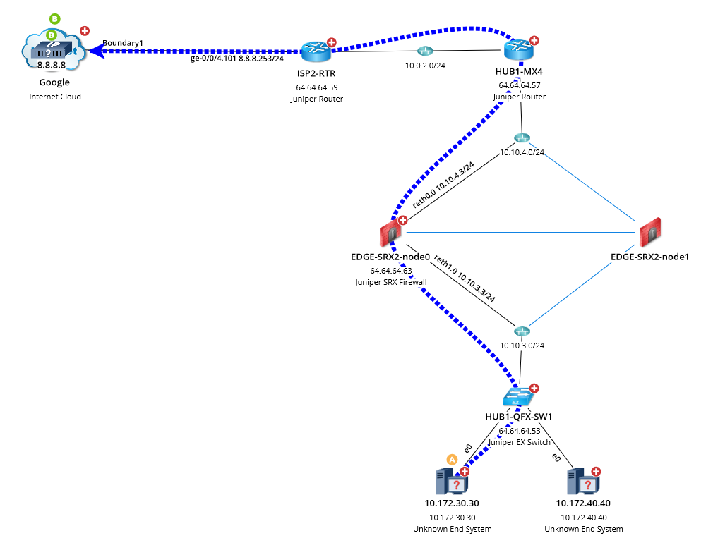
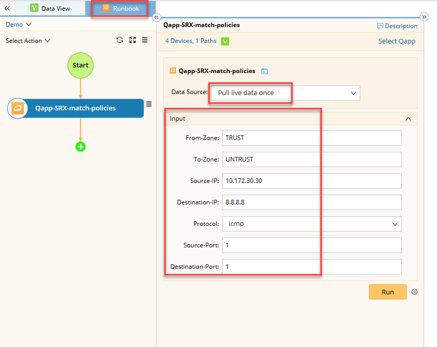
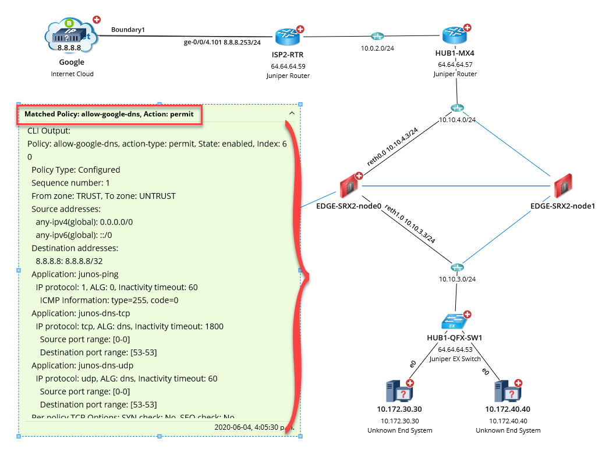
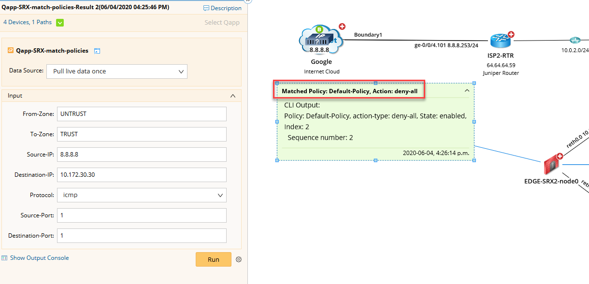

# Find SRX Security Policy
This is a solution to quickly find which security policy will be applied to a particular traffic flow as per firewall's configuration.

**Version: NetBrain v8.x**

## Use Case

Many times you want to quickly find out if a firewall's policy is matching a particular traffic flow or not. This Qapp lets you do just that. Given the traffic parameter like the source and destination zones and addresses etc, the Qapp will query the SRX to determine what action (permit/deny) will be taken if such a traffic was to pass through the firewall.

## Solution

### 1. Put the SRX no the Map

Although, you can run the Qapp without any device on the map, however, it would make it easier to put the SRX in question on the map or run the Qapp on an existing Map. Below is a demo network map where we would like to check if an internal host 10.172.30.30 is allowed to reach google's DNS server at 8.8.8.8.




### 2. Add Qapp, Fill Traffic Details and Run the Qapp

* Select the `Runbook` tab besides the `Data View` tab.
* Click the `GREEN plus sign`, select `Qapp` and then navigate and add the Qapp to the runbook.
* Fill in the traffic details under the `Input` section, make sure the `Data Source` is set to `Pull live data once`. Then `Run` the Qapp.




## Results

* Once the Qapp completes execution, a device note will appear besides the SRX that will summarize the results in the header mentioning the `policy name` matched against the traffic and the `acton` to be taken based on that policy.
* You can expand the device note to see full details about the matched policy.




* As another example, we changed the traffic direction and saw the following results meaning that the traffic was denied because of the default `deny-all` rule which was correct as per the configured policy.




* The following is a short demonstration of steps:


#### Sample Command Output

Following command was used by the Qapp in this demonstration:

````
admin@EDGE-SRX2-node0> show security match-policies from-zone TRUST to-zone UNTRUST source-ip 10.172.30.30 destination-ip 8.8.8.8 protocol icmp source-port 1 destination-port 1 
node0:
--------------------------------------------------------------------------
Policy: allow-google-dns, action-type: permit, State: enabled, Index: 6
0
  Policy Type: Configured
  Sequence number: 1
  From zone: TRUST, To zone: UNTRUST
  Source addresses:
    any-ipv4(global): 0.0.0.0/0 
    any-ipv6(global): ::/0
  Destination addresses:
    8.8.8.8: 8.8.8.8/32
  Application: junos-ping
    IP protocol: 1, ALG: 0, Inactivity timeout: 60
      ICMP Information: type=255, code=0
  Application: junos-dns-tcp
    IP protocol: tcp, ALG: dns, Inactivity timeout: 1800
      Source port range: [0-0] 
      Destination port range: [53-53]
  Application: junos-dns-udp
    IP protocol: udp, ALG: dns, Inactivity timeout: 60
      Source port range: [0-0] 
      Destination port range: [53-53]
  Per policy TCP Options: SYN check: No, SEQ check: No

{primary:node0}
admin@EDGE-SRX2-node0> 

````

## Resource
Qapp Download Link: [Qapp-SRX-match-policies.xapp](resources/Qapp-SRX-match-policies.xapp)


### *Disclaimer*
*The solution provided above is developed by testing environment so may not suit to every scenario, please feel free to contact NetBrain Support <Support@netbraintech.com> if any questions related to the solution.* 

