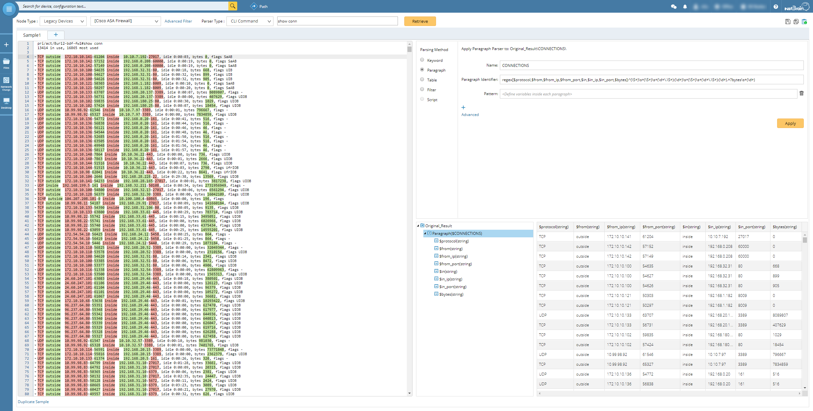
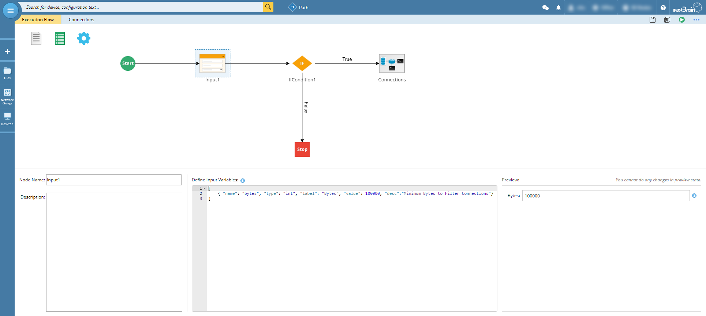
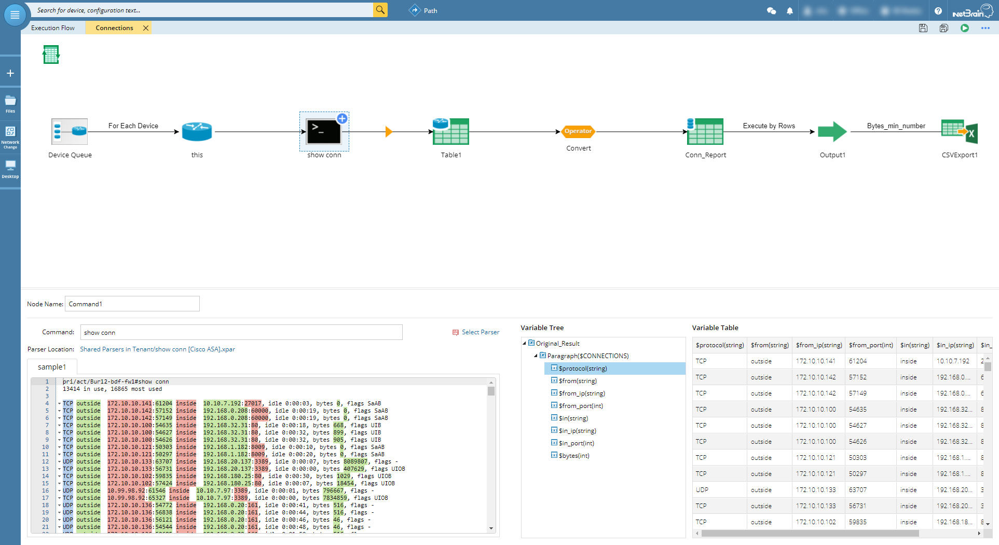
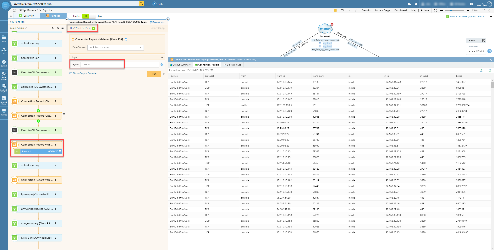
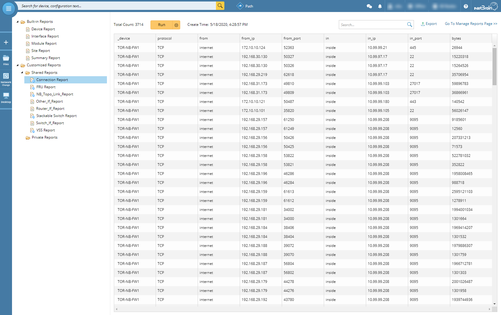
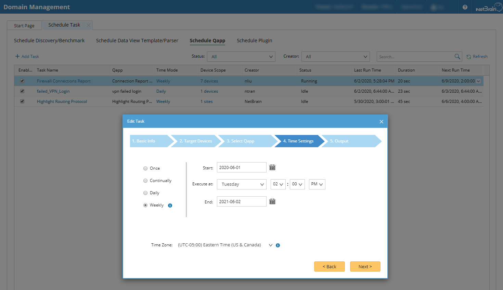
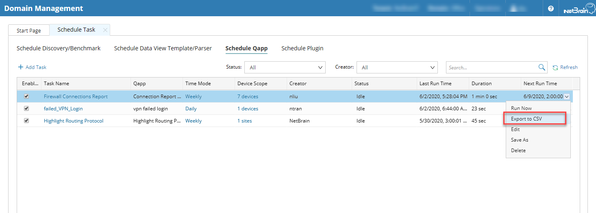

# Get Top Session From Firewall
By using NetBrain Automation to quickly pull out and sort top session based on cli output.

*Version: NetBrain v7.x, v8.x*

## Use Case

In daily network operation, to understand top talkers or sessions are helpful to identify critical path for utilization analysis or security audit purpose. If Netflow is not configured, using session data from firewall could be a way to analyst.

The example is based on Cisco ASA firewall, but similar concept could apply to other vendors.

## Solution

### 1. Parser CLI Command

* Create Cisco ASA parser `show conn` under `Parser Library`.

*refer link: https://www.netbraintech.com/docs/ie80/help/index.html?parser-library.htm*

### 2. Create Automated Report Qapp

* Create NetBrain Qapp to procedure the logic.

* Add the `Input` module to allocate minimum `Bytes` to filter result, and default value can be set as well.

* By using the `show conn [Cisco ASA]` parser, export the result to a CSV.

*refer link: https://www.netbraintech.com/docs/ie80/help/index.html?qapp.htm*

### 3. Execute the Qapp
#### 3.1 Run Qapp on a map

#### 3.2 Run Qapp as report

* Need set up and manual click `Run` to get result.

*refer link: https://www.netbraintech.com/docs/ie80/help/index.html?qapp_based-report.htm*
#### 3.3 Schedule Qapp 

* Schedule Qapp based on the frequency.

* View scheduled result

*refer link: https://www.netbraintech.com/docs/ie80/help/index.html?creating-a-qapp-schedule.htm*

## Results

* The Report can be sort and search to analyst result.
* The Report can be downloaded and archive.

## Resource
Qapp Download Link: [Connection Report [Cisco ASA].xapp](resources/Connection%20Report%20%5BCisco%20ASA%5D.xapp)

### *Disclaimer*
*The solution provided above is developed by testing environment so may not suit to every scenario, please feel free to contact NetBrain Support <Support@netbraintech.com> if any questions related to the solution.* 