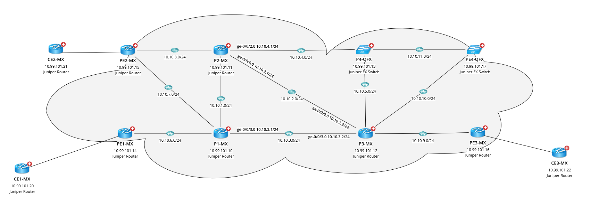

# Ping CE MAC Address Across a VPLS Domain
This is a solution to quickly verify data plane through a VPLS domain by pinging the MAC address of a remote CE device from any PE participating in the VPLS domain.

**Version: NetBrain v8.x**

## Use Case

Troubleshooting issues in a VPLS domain can be challenging. However, if you can verify the data plane from one PE to another, that can be a quick win. This Qapp lets you verify the data plane connectivity by checking reachability of a CE device's MAC from any PE participating in a particular VPLS domain. To start off, you would need to know the MAC address of a CE device. You might have already been provided this as part of the troubleshooting exercise. We can also pick from one of the PE devices as we will see later.

## Demo Network

Below is a sample VPLS network consisting of Juniper P and PE devices. Say we want to verify connectivity from PE3 for a customer's MAC address. 




We can use the following command to pick a MAC address that is learned from the VPLS domain (next-hop would be an vt-* interface).

```
admin@PE3-MX> show vpls mac-table    

MAC flags       (S -static MAC, D -dynamic MAC, L -locally learned, C -Control MAC
    O -OVSDB MAC, SE -Statistics enabled, NM -Non configured MAC, R -Remote PE MAC)

Routing instance : VPLS-CE3-C
 Bridging domain : __VPLS-CE3-C__, VLAN : NA
   MAC                 MAC      Logical          NH     RTR
   address             flags    interface        Index  ID
   00:05:86:71:25:04   D        vt-0/0/10.1050114
   00:05:86:71:ce:01   D        vt-0/0/10.1050117
   00:05:86:71:e3:f0   D        ge-0/0/2.800    

admin@PE3-MX> 
```


## Solution

### 1. Add Qapp to the Map

* Select the `Runbook` tab besides the `Data View` tab.
* Click the `GREEN plus sign`, select `Qapp` and then navigate and add the Qapp to the runbook.
* MAke sure the `Data Source` is set to `Pull live data once` and using the `Devices` drop-down, choose only the PE device you want to perform the ping from. In our example, we selected PE3-MX.


### 2. Specify the Inputs to the Qapp

* For the `VPLS Instance` name, enter the exact name of the VPLS instance configured on the local PE. 
* For the `Destination MAC` address, we are using the first MAC address from the earlier output. It can be any MAC address learned from the VPLS domain, to be specified here in a similar format. 
* For the `Source IP Address`, specify the IP address of the local PE's interface that is facing the MPLS core. In our example, the core facing interface is ge-0/0/4 on PE3 and its IP address is 10.10.9.1 as shown below:


## Results

Once the Qapp completes execution, and if the local PE is able to ping the MAC address successfully via the VPLS domain, you would see a few things added to the map:

* `A Device Note` is added to the PE initiating the ping. The note's header will summarize the ping result stating how many ping packets were `sent` and `received`. 
* The destination PE which is learning the MAC address via a PE-CE link is `highlighted`.
* An `arrow` is drawn from the local PE to the remote PE. This is __NOT__ a representation of the traffic path. It is only to make things visually clear on a large map.

These elements can be seen in the below screenshot:


If we expand the `Device Note`, we can get more details including the PE-CE interface on the remote PE where the MAC address was learned from:


In case the ping fails. there will be no device highlighting and the `Device Note` would look something like the following:


#### Sample Command Output

Following command was used by the Qapp in this demonstration:

````
admin@PE3-MX> ping vpls instance VPLS-CE3-C destination-mac 00:05:86:71:25:04 source-ip 10.10.9.1    
! -> PE2-MX:VPLS-CE2-C:ge-0/0/4.800 
! -> PE2-MX:VPLS-CE2-C:ge-0/0/4.800 
! -> PE2-MX:VPLS-CE2-C:ge-0/0/4.800 
! -> PE2-MX:VPLS-CE2-C:ge-0/0/4.800 
! -> PE2-MX:VPLS-CE2-C:ge-0/0/4.800 

--- vpls ping statistics ---
5 packets transmitted, 5 packets received, 0% packet loss

admin@PE3-MX> 
````


## Resource
Qapp Download Link: [Qapp-Juniper-VPLS-ping.xapp](resources/Qapp-Juniper-VPLS-ping.xapp)


### *Disclaimer*
*The solution provided above is developed by testing environment so may not suit to every scenario, please feel free to contact NetBrain Support <Support@netbraintech.com> if any questions related to the solution.* 

